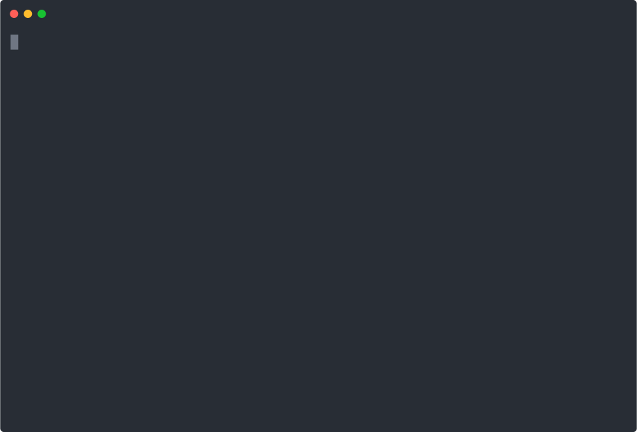

# MinusOps — a governed, multi-cloud infrastructure control plane

MinusOps is a **workload-agnostic governance engine** for Terraform. It does not ship a
particular architecture — you point it at *your* Terraform directory and *your* cloud
credentials, and it wraps every change in a plan-bound, MFA-gated, fully audited deploy
gate. Nothing is hosted by anyone else; each team runs it against their own account.

> Looking for the deep operating guide (safety rules, doc-fetch policy, workflows)?
> See [`AGENTS.md`](./AGENTS.md). This README is the quick start.

---

## See it (offline, no cloud)



*`minusctl demo` → `prove` → `audit verify` → tests — no cloud credentials required.
The demo resolves a request into a governed blueprint and emits a full, plan-hash-keyed
report bundle from synthetic plan JSON.*

**Try it in 30 seconds:**

```bash
pip install .
minusctl demo governed-data-pipeline --owner data-platform --daily-data-gb 50
minusctl prove          # prove the offline governance chain end-to-end (writes evidence.md)
minusctl audit verify   # confirm the tamper-evident audit trail
```

Each run writes a versioned bundle under `runs/<run-id>/reports/<plan-hash>/`. The full
walkthrough below is reproducible from that one command — no cloud needed.
*(Same tour as a standalone page: [docs/walkthrough.md](docs/walkthrough.md).)*

### The live FinOps console

`python app/dashboard_app.py` serves a fixed-screen, tabbed console (account id redacted here):

| Overview — live spend, anomalies, burn | Optimization — security/cost/observability scan |
|:---:|:---:|
| [](docs/walkthrough/01-overview.png) | [](docs/walkthrough/02-optimization.png) |
| **Reports — every plan-hash bundle** | **Readiness — enterprise score per run** |
| [](docs/walkthrough/03-reports.png) | [](docs/walkthrough/04-readiness.png) |

### Architecture → Terraform (click-to-code)

A real topology — runtime data flow over an orchestration & governance lane, KMS locks, and a
deployment-posture strip:

[](docs/walkthrough/05-architecture.png)

**Click any service box** and the inspector opens the exact plan-bound Terraform that
provisions it — syntax-highlighted — plus that resource's findings. Here the **Glue Job** box
opens `glue.tf`. No SaaS diagram tool binds the picture to the approved plan hash like this:

[](docs/walkthrough/06-architecture-code.png)

### Plan & cost reports

| Plan report (review artifact, gated) | Cost report — forecast vs. actual |
|:---:|:---:|
| [](docs/walkthrough/09-plan-report.png) | [](docs/walkthrough/10-cost-report.png) |

### Resources & services

Every planned resource — address, type, action, mapped service, owning `.tf` file — and the
same data grouped by service:

| Resources | Services |
|:---:|:---:|
| [](docs/walkthrough/07-resources.png) | [](docs/walkthrough/08-services.png) |

<sub>The cost figures shown use **illustrative sample** BCM / Cost Explorer data so the report renders offline. Real numbers come **only** from the AWS BCM Pricing Calculator (forecast) and Cost Explorer (actuals) — MinusOps never hardcodes a price. The demo terminal cast is in [`docs/demo/minusops-demo.cast`](docs/demo/minusops-demo.cast) (replay with `asciinema play`).</sub>

---

## What it gives you

- **A plan-bound deploy gate** (`core/plan_gate.py`) — `verify → plan → hash → approve → apply`.
  The SHA-256 of the planned changes is the contract: any `.tf` edit produces a new hash,
  which voids the prior approval and forces a fresh review. `apply` runs *only* the exact
  plan you approved. Approval records are bound to the Terraform directory and plan hash.
  The gate never handles secrets — you authenticate your cloud CLI first.
- **A cloud abstraction** (`core/providers/`) — the engine talks to AWS / Azure / GCP through
  one interface, selected by `MINUS_CLOUD` (default `aws`). AWS is fully implemented; Azure and
  GCP are scaffolds that degrade gracefully.
- **A governed intent layer** (`core/intent_resolver.py`, `core/blueprints.py`) — short enterprise
  requests like "create a data pipeline" resolve to approved blueprints and required inputs instead
  of free-form infrastructure or accidental deploys.
- **Cost intelligence** — live spend, anomalies, and root-cause correlation (`core/finops_agent.py`),
  AWS BCM Pricing Calculator payload preparation (`core/bcm_pricing_calculator.py`),
  reviewed usage-profile support for internal services ([`docs/pricing_catalog_support.md`](./docs/pricing_catalog_support.md)),
  and a Plotly Dash console (`app/dashboard_app.py`).
- **Safety primitives** — an approval gate with **approver RBAC** (`core/approval.py`,
  `core/authz.py`), a **tamper-evident hash-chained** audit trail (`core/audit_chain.py`,
  verify with `minusctl audit verify`), a **per-resource** HCL security/cost scanner with an
  optional checkov/tfsec hook (`core/optimize_analyzer.py`), live health probes, and a
  versioned, plan-hash-keyed deploy report whose architecture diagram conforms to a binding
  cross-tool spec (`core/reporter.py`, enforced by golden tests).
- **Source drift visibility** — generated Terraform workspaces carry a local `.minus/` baseline,
  so later manual edits can be shown with `source_guard status|diff` before a plan exists.

This repo is **just the engine**. There is no bundled example architecture — every CLI that
acts on infrastructure requires you to pass an explicit `--dir` / `--source-dir`.

> **Cloud scope:** AWS is the production-wired provider today. Azure and GCP are honest
> roadmap scaffolds that degrade gracefully (`MINUS_CLOUD=azure|gcp`); see
> `core/providers/base.py:capabilities()`.

---

## Install

```bash
pip install .                 # console scripts: minusctl, minus-gate, minus-resolve, minus-bcm, ...
pip install ".[dashboard]"    # + the Plotly Dash FinOps console
# or the self-contained container (pinned terraform + aws CLI baked in):
docker build -t minusops . && docker run --rm -v "$PWD:/work" -w /work minusops minusctl --help
```

The documented `python core/<tool>.py ...` invocations still work from a source checkout;
the installed `minusctl` / `minus-gate` console commands are the packaged equivalents.
For configuration (RBAC, audit, BCM) and day-2 tasks see
[`docs/operations_runbook.md`](./docs/operations_runbook.md); for trust boundaries see
[`docs/security_model.md`](./docs/security_model.md).

## Quick start

```bash
# 1. (optional) configure approver RBAC before production
export MINUS_OPERATOR="alice@corp"
export MINUS_APPROVERS="alice@corp,bob@corp"   # else the gate runs in recorded "open" mode

# 2. Authenticate with IAM Identity Center / SSO (the recommended method —
#    short-lived credentials, MFA at login, no long-term secret on disk)
aws configure sso        # one-time
aws sso login            # each session

# 3. Govern a change to YOUR terraform directory
minus-gate run --dir path/to/your/terraform
#   verify (fmt + validate + per-resource security scan) → plan (+ plan-hash) → approve (review + RBAC) → apply
#   apply refuses long-term static keys — use `aws sso login` or an assumed MFA role
#   then: minusctl audit verify   # confirm the tamper-evident audit chain
```

Provision the MFA-gated deploy role and read-only FinOps role from
[`examples/iam/`](./examples/iam/) so the credential checks are backed by real IAM.

```bash
# 4. Resolve short creation intent into a governed blueprint (no deploy)
python core/intent_resolver.py --validate-blueprints
python core/intent_resolver.py --list-blueprints
python core/intent_resolver.py "create a governed AWS data pipeline"
python core/dispatcher.py "build a data pipeline"

# 4b. Create a fresh governed run workspace and generate Terraform only
python core/minusctl.py create "create a governed AWS data pipeline" --input owner=data-platform --input daily_data_gb=50 --generate
python core/minusctl.py next
python core/minusctl.py readiness
python core/minusctl.py guard status
python core/minusctl.py guard diff
python core/minusctl.py package

# The lower-level commands remain available
python core/workflow.py resolve "create a governed AWS data pipeline" --input owner=data-platform --input daily_data_gb=50 --generate
python core/source_guard.py status --dir runs/<run-id>/terraform
python core/source_guard.py diff --dir runs/<run-id>/terraform

# Optional no-cloud demo report, with synthetic plan JSON and no Terraform/AWS calls
python core/minusctl.py demo governed-data-pipeline --owner data-platform --daily-data-gb 50
python core/minusctl.py reports services --latest
python core/minusctl.py reports roles --latest

# 5. Inspect cost / health any time (read-only, safe)
python core/finops_agent.py --cost
python core/health_checker.py --bronze-bucket my-bucket --job-1 my-glue-job
python core/optimize_analyzer.py --source-dir path/to/your/terraform

# 6. Live FinOps console
python app/dashboard_app.py     # http://127.0.0.1:8050
```

Select a different cloud with `MINUS_CLOUD=azure|gcp` (AWS is the only fully-wired provider today).

---

## Tests

```bash
pip install ".[dev]"
python -m pytest -q          # 101 tests
```

The suite covers the load-bearing guarantees: plan-hash determinism, approval-voids-on-drift,
apply-refuses-on-mismatch, the approval gate's fail-closed behavior, approver RBAC, the
tamper-evident audit chain (including legacy-prefix tolerance and `seal`), the per-resource HCL
scanner rules, the BCM forecast-vs-actual variance logic, golden tests for the binding
architecture-SVG/report contract, and a **real-terraform end-to-end gate test**
(`tests/test_gate_e2e.py`, auto-skips if terraform is absent). CI runs the whole suite on
Linux/macOS/Windows × Python 3.10/3.12 (`.github/workflows/ci.yml`).

For a fast, no-cloud confidence check that the whole chain works on *your* machine, run
`minusctl prove` — it generates a run, verifies the report artifacts and audit chain, scores
readiness, and writes `evidence.md` / `evidence.json` listing exactly which AWS-gated steps
remain. After a real deploy, `minus-bcm actuals --report-dir <dir>` pulls Cost Explorer actuals
and rebuilds `cost.pdf` with the forecast-vs-actual table.

---

## Layout

```
core/                 governance engine (gate, approval, audit, finops, scanner, reporter)
core/minusctl.py      safe operator CLI for create, next, readiness, guard, reports, package, and demo
core/blueprints.py    governed blueprint registry for short enterprise intent
core/intent_resolver.py intent-to-blueprint resolver; never deploys
core/workflow.py      safe request -> blueprint -> run workspace -> optional Terraform generation
core/source_guard.py  local source baseline and manual edit diff for generated Terraform
core/plan_inspector.py inspect services, resources, roles, files, and drift from reports
core/providers/       cloud abstraction (aws implemented; azure/gcp scaffolds)
app/dashboard_app.py  live FinOps console (Plotly Dash)
tools/doctor.ps1      local environment diagnostics
docs/                 doc index, IAM manifesto, architecture-diagram spec
tests/                pytest suite for the gate, approval, and scanner
.github/workflows/    generic OIDC CI (validate + human-gated deploy; you pass the tf dir)
```

You provide the Terraform. MinusOps governs how it ships.
