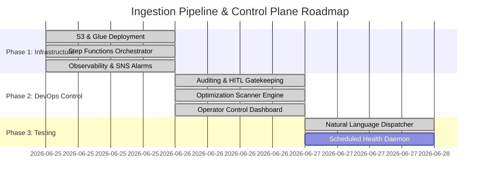

# MinusOps Control Plane — Project Plan

This project plan maps out the completed milestones and outlines the remaining deliverables required to test, run, and maintain the agentic DevOps workflow.

> **Note (pivot):** the repo is now the **generic governance engine only**. The original AWS
> medallion-pipeline example (its `*.tf`, ETL scripts, and the `bootstrap/aws` governance IaC)
> was removed so the engine stays workload-agnostic — you bring your own Terraform and pass an
> explicit `--dir`. The history below is kept for context; the medallion milestones validated the
> engine against a real workload before it was generalised.

---

## Project Milestones & Status



---

## Natural Language Intent Dispatcher
We deployed a central query parsing coordinator: [dispatcher.py](/core/dispatcher.py).

Rather than executing scripts individually, operators can type vague queries. Operational queries still route to the target script:
* **Query**: `"check if the pipeline is online"` &rarr; triggers `health_checker.py`.
* **Query**: `"audit the code security"` &rarr; triggers `optimize_analyzer.py`.
* **Query**: `"forecast the monthly cost"` &rarr; triggers `budget_calculator.py`.
* **Query**: `"why did spend spike / find anomalies"` &rarr; triggers `finops_agent.py` (live AWS).
* **Query**: `"apply the changes"` &rarr; triggers `plan_gate.py run` (the deploy gate).

Creation requests now take a safer enterprise path through [intent_resolver.py](/core/intent_resolver.py) and [blueprints.py](/core/blueprints.py):
* **Query**: `"create a data pipeline"` &rarr; resolves to `aws-data-pipeline-standard`.
* The resolver lists the required business inputs and next safe actions.
* It does not generate Terraform, plan, or apply infrastructure by itself.
* The blueprint registry can be checked with `python core/intent_resolver.py --validate-blueprints`.

---

## What Has Been Built (Completed)

1. **Reference workload (removed after validation)**:
   * The medallion pipeline (S3 bronze/silver/gold with KMS + lifecycle, PySpark ETL jobs, a
     Step Functions orchestrator with SQS DLQ + EventBridge triggers, and CloudWatch→SNS alarms)
     was built first to exercise the engine end-to-end, then deleted so the repo is engine-only.
   * It remains recoverable from git history if a worked example is needed for reference.
2. **`agy` Customizations & Diagnostics**:
   * Workspace Rules ([AGENTS.md](/.agents/AGENTS.md)) to enforce safety boundaries.
   * [audit_logger.py](/core/audit_logger.py) and [plan_gate.py](/core/plan_gate.py) to audit actions and gate mutating deployments (plan-bound, MFA via the cloud CLI).
   * [approval.py](/core/approval.py) approval gate with selectable `gatekeeper` / `auto-approve` modes for side effects.
   * [finops_agent.py](/core/finops_agent.py) live cost intelligence over the real account (Cost Explorer, anomalies, CloudTrail correlation).
   * [optimize_analyzer.py](/core/optimize_analyzer.py) configuration scanner.
   * [intent_resolver.py](/core/intent_resolver.py) and [blueprints.py](/core/blueprints.py) to map short enterprise creation requests to governed blueprint decisions.
   * Live FinOps operator console ([app/dashboard_app.py](/app/dashboard_app.py)) — a Plotly Dash app rendering real spend, monthly burn, and the anomaly ledger via the active cloud provider.

---

## Validation Checkpoint — 2026-06-28

Completed:

* Fresh governed run generated through `core/minusctl.py create ... --generate`.
* No-cloud demo report generated under `runs/20260628-140643-aws-data-pipeline-standard/reports/4e15b11621e2`.
* Report artifacts present: `architecture.svg`, `plan.json`, `cost.json`, `plan.html`, `cost.html`, `report.html`, `plan.pdf`, `cost.pdf`, `bcm-assumptions.json`, and BCM review payloads.
* PDF rendering now has a built-in text fallback when Edge/Chrome DevTools rendering is unavailable.
* Full test suite passed with a workspace-local temp directory: `39 passed`.
* HCL optimization scanner completed successfully when writing to `artifacts/review/`.
* Dashboard server started successfully on `http://127.0.0.1:8077/`.
* `core/minusctl.py readiness` reports `NEEDS_EVIDENCE` with score `93/100`; the only remaining warning is missing AWS BCM Pricing Calculator evidence.

Environment blockers:

* `terraform.exe` is installed at the WinGet package path, but this session cannot execute it (`EPERM` / `WinError 5`). Because of that, `plan_gate.py verify` and `plan_gate.py plan` could not complete here. No Terraform apply was attempted.
* AWS BCM Pricing Calculator run correctly refused execution because all generated usage lines still contain `REVIEW_REQUIRED` usageType/operation placeholders. This prevents publishing unsupported cost totals until the usage evidence is reviewed and approved.
* Headless Edge screenshot capture failed in this session because the browser GPU process was unusable. The dashboard server and report artifacts exist, but screenshots could not be captured here.

Next manual validation outside this restricted session:

```powershell
python core/plan_gate.py verify --dir runs/20260628-140643-aws-data-pipeline-standard/terraform
python core/plan_gate.py plan --dir runs/20260628-140643-aws-data-pipeline-standard/terraform
python core/minusctl.py readiness --run 20260628-140643-aws-data-pipeline-standard
python core/minusctl.py package --run 20260628-140643-aws-data-pipeline-standard
python app/dashboard_app.py
```
