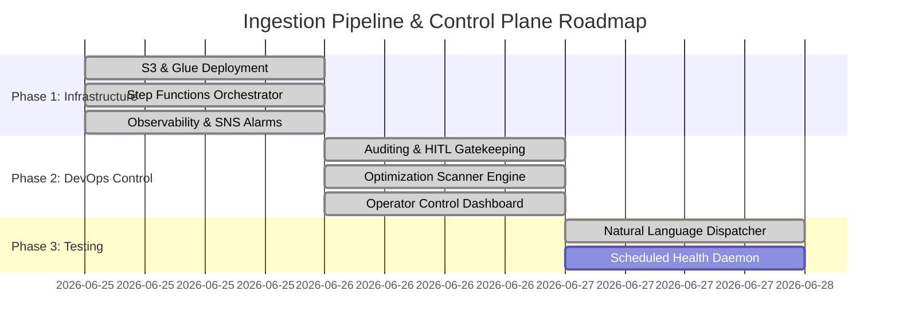

# MinusOps Control Plane — Project Plan

This project plan maps out the completed milestones and outlines the remaining deliverables required to test, run, and maintain the agentic DevOps workflow.

> **Note (pivot):** the repo is now the **generic governance engine only**. The original AWS
> medallion-pipeline example (its `*.tf`, ETL scripts, and the `bootstrap/aws` governance IaC)
> was removed so the engine stays workload-agnostic — you bring your own Terraform and pass an
> explicit `--dir`. The history below is kept for context; the medallion milestones validated the
> engine against a real workload before it was generalised.

---

## Project Milestones & Status



---

## Natural Language Intent Dispatcher
We deployed a central query parsing coordinator: [dispatcher.py](/core/dispatcher.py).

Rather than executing scripts individually, operators can type vague queries. Operational queries still route to the target script:
* **Query**: `"check if the pipeline is online"` &rarr; triggers `health_checker.py`.
* **Query**: `"audit the code security"` &rarr; triggers `optimize_analyzer.py`.
* **Query**: `"forecast the monthly cost"` &rarr; triggers `budget_calculator.py`.
* **Query**: `"why did spend spike / find anomalies"` &rarr; triggers `finops_agent.py` (live AWS).
* **Query**: `"apply the changes"` &rarr; triggers `plan_gate.py run` (the deploy gate).

Creation requests now take a safer enterprise path through [intent_resolver.py](/core/intent_resolver.py) and the requirements/architecture decision record:
* **Query**: `"create a data pipeline"` &rarr; creates a requirements-first run; no production Terraform is generated until requirements and an architecture decision are recorded.
* The resolver creates a requirements-first path and lists the next safe actions.
* It does not generate Terraform, plan, or apply infrastructure by itself.
* The blueprint registry can be checked with `python core/intent_resolver.py --validate-blueprints`.

---

## What Has Been Built (Completed)

1. **Reference workload (removed after validation)**:
   * The medallion pipeline (S3 bronze/silver/gold with KMS + lifecycle, PySpark ETL jobs, a
     Step Functions orchestrator with SQS DLQ + EventBridge triggers, and CloudWatch→SNS alarms)
     was built first to exercise the engine end-to-end, then deleted so the repo is engine-only.
   * It remains recoverable from git history if a worked example is needed for reference.
2. **`agy` Customizations & Diagnostics**:
   * Workspace Rules ([AGENTS.md](/.agents/AGENTS.md)) to enforce safety boundaries.
   * [audit_logger.py](/core/audit_logger.py) and [plan_gate.py](/core/plan_gate.py) to audit actions and gate mutating deployments (plan-bound, MFA via the cloud CLI).
   * [approval.py](/core/approval.py) approval gate with selectable `gatekeeper` / `auto-approve` modes for side effects.
   * [finops_agent.py](/core/finops_agent.py) live cost intelligence over the real account (Cost Explorer, anomalies, CloudTrail correlation).
   * [optimize_analyzer.py](/core/optimize_analyzer.py) configuration scanner.
   * [intent_resolver.py](/core/intent_resolver.py) to map short enterprise creation requests to requirements-first runs and architecture decisions.
   * Live FinOps operator console ([app/dashboard_app.py](/app/dashboard_app.py)) — a Plotly Dash app rendering real spend, monthly burn, and the anomaly ledger via the active cloud provider.

---

## Current Status

What runs end to end, offline, with no cloud credentials:

* Governed production runs start via `core/minusctl.py create ...`; Terraform generation waits for completed requirements and an architecture decision. The no-cloud
  `minusctl demo`, producing the full report bundle (`architecture.svg`, `plan.json`,
  `cost.json`, `plan.html`/`.pdf`, `cost.html`/`.pdf`, `report.html`, and BCM review payloads).
* PDF rendering has a built-in text fallback when headless Edge/Chrome is unavailable.
* The full test suite passes (`python -m pytest`).
* `minusctl prove` confirms the offline governance chain (run → report artifacts → audit-chain
  integrity → readiness) and reports the remaining AWS-gated steps.
* Cost totals publish only from the AWS BCM Pricing Calculator; generated usage carries
  `REVIEW_REQUIRED` placeholders until a reviewed profile is supplied, so unsupported totals are
  never fabricated.

The AWS-side steps require live credentials and Terraform, and are run by the operator against
their own account:

```powershell
python core/plan_gate.py verify --dir runs/<run-id>/terraform --policy-mode production
python core/plan_gate.py plan   --dir runs/<run-id>/terraform
python core/minusctl.py readiness --run <run-id>
python core/minusctl.py package   --run <run-id>
python app/dashboard_app.py
```

---

## Roadmap (2026-07) — from validated engine to scale-aware data platform

Set after the first end-to-end agent-driven run (`build us a data pipeline for sales data`
→ 100/100 readiness, AWS-priced $116.59/mo). Ordered by dependency, not ambition.

### Phase A — Hardening (close what the live run exposed)
1. Port the four run-local module fixes upstream (`compute-glue-etl` computed-count alarm,
   Step Functions null-field state machine, results-bucket lifecycles in
   `dq-great-expectations` + `query-athena`).
2. Readiness "core files present" must check content, not existence (an agent gamed it
   with one-line comment stubs in the first run).
3. `guard refresh` needs a second pair of eyes: require a different operator (or an
   explicit `--i-edited-generated-code` ack that lands in the audit log).
4. Commit the branch (everything to date is uncommitted).

### Phase B — Cost completeness (make the forecast whole)
1. Synthesizer maps the requirements volume answer into a `daily_data_gb` variable so S3
   prices and cost/GB unit economics fire on every run.
2. Budget-vs-forecast: compare the BCM total to the plan's own `monthly_budget_usd` in the
   cost report + an overview tile (both numbers already exist).
3. Showback tags: stamp `run_id`/`owner` into `default_tags` so Cost Explorer can attribute
   actuals per pipeline (per-team showback, the FinOps allocation capability).
4. Post-deploy actuals cadence: scheduled `bcm actuals` pull + variance alert when actuals
   drift ≥N% from forecast.

### Phase C — Scale-awareness (GB → TB → PB are different products)
The six-layer model stays; the module choices, conformance checks, and cost mechanics
change per tier. Encode the tier as a first-class field of the data profile
(`daily volume: GB / TB / PB`, growth, latency class, query concurrency) and drive:

| Concern | GB/day (current sweet spot) | TB/day | PB total / 100s TB/day |
| :-- | :-- | :-- | :-- |
| Compute | Glue (2 workers, Flex, bookmarks) | Glue autoscaling / EMR Serverless; compaction jobs mandatory | EMR on EC2/EKS with SP/RI commitments |
| Storage | S3 standard + lifecycle | Partitioning + columnar enforced; Intelligent-Tiering | Iceberg/Delta table format mandatory; partition indexes |
| Ingestion | S3 batch drops | Firehose/Kinesis; DMS for CDC | MSK / DMS fleets; multi-account landing |
| Consumption | Athena per-query | Athena + scan cutoffs scaled; result reuse | Redshift RA3/Serverless for BI concurrency |
| Governance | KMS + IAM roles | Lake Formation permissions | Data mesh, cross-account, mandatory chargeback |
| Cost strategy | on-demand list | scenario-check commitments | commitments dominate; EDP; unit-economics SLOs |

Deliverables:
1. **Tiered decision matrix** in the architect phase (deterministic, cited to AWS guidance)
   — same requirements schema, different composed modules per tier.
2. **Tier-conditional conformance**: e.g. TB-tier plan without partitioned tables /
   columnar / compaction → HIGH finding; PB-tier without a table format or commitment plan
   → HIGH. (Today's DATA-01..03 are the GB-tier versions of these checks.)
3. **Cost-at-scale section** in the cost report: BCM bill scenarios at 1×/5×/10× declared
   volume (AWS prices each point — no local extrapolation), rendering the scaling curve and
   cost/GB at each point so diseconomies show up before they are deployed.
4. New modules as tiers demand them: `ingest-firehose`, `table-format-iceberg`,
   `compute-emr-serverless`, `consumption-redshift-serverless`, `compaction-glue`.

### Phase D — Product surface
1. Optimization tab: surface DATA-* advisories + scenario shortcuts (thinnest tab today).
2. Decision versioning/diff in the Control tab.
3. Multi-run trends in Readiness (score and cost/GB across runs).

### Researched trigger thresholds (evidence for the tier matrix — 2026-07-02)
These are the published numbers that turn "scale tier" from opinion into checkable rules;
each becomes a tier-conditional conformance check or advisory finding:

| Signal | Threshold (source) | Consequence in MinusOps |
| :-- | :-- | :-- |
| File size | target ~128 MB splits; many small files = 62–88% slower, S3 rate-limit errors (AWS Athena tuning) | TB tier: compaction module required, finding if absent |
| Partitioning | partition filter = 99% cheaper / 85% faster; >100k partitions need partition indexes (16x speedup) (AWS) | TB tier: unpartitioned tables = HIGH finding; PB tier: partition indexes required |
| Columnar | CSV→Parquet ≈ 91–99.9% cheaper scans (AWS); 70% storage / 80% time saved (telecom case) | TB tier: non-columnar storage = HIGH finding |
| Query concurrency | Athena default 20 concurrent; hundreds of users → warehouse-class engine (Firebolt/Hevo) | consumers>~50 in requirements → recommend Redshift/warehouse module |
| Warehouse economics | 115 TB + 2–3%/mo growth broke BigQuery/Postgres economics; Iceberg beat Hudi 3x; engine concurrency behavior diverges (TRM Labs) | ≥100 TB total: table-format module mandatory, engine benchmark advisory |
| Compute engine | Glue $0.44/DPU-h wins for short/infrequent; EMR for long-running; EMR Serverless for unpredictable (comparisons) | job-hours/day from assumptions drive compute module choice + scenario check |
| Streaming | micro-batch (1–2s) over pure streaming at high velocity; CDC for change-heavy sources | latency-class requirement selects ingest module (batch / Firehose / MSK+CDC) |
| Org scale | central-team bottleneck → data mesh; per-job I/O chargeback (Uber) | multi-team requirement → multi-account/showback pattern (v2) |
| Quality | silent data-quality failures compound at scale ($5M mispricing case) | DQ module stays mandatory at every tier ≥ TB |
