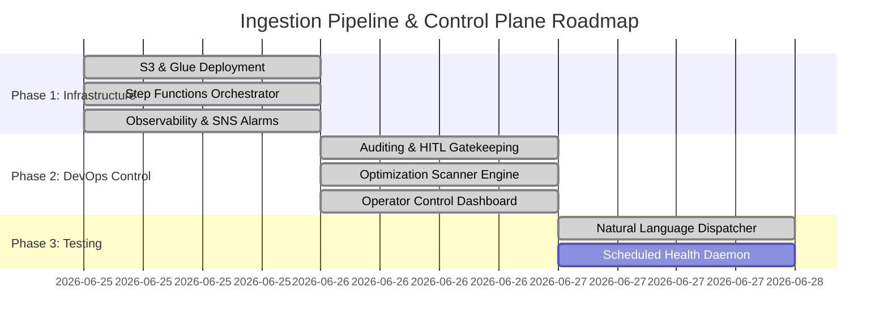

# AWS Medallion Ingestion Pipeline & Control Plane Plan

This project plan maps out the completed milestones and outlines the remaining deliverables required to test, run, and maintain the agentic DevOps workflow.

---

## 🗺️ Project Milestones & Status

---

## 🤖 Natural Language Intent Dispatcher
We deployed a central query parsing coordinator: [dispatcher.py](/core/dispatcher.py). 

Rather than executing scripts individually, operators can type vague queries. The dispatcher maps the keywords to the target script:
* **Query**: `"check if the pipeline is online"` &rarr; triggers `health_checker.py`.
* **Query**: `"audit the code security"` &rarr; triggers `optimize_analyzer.py`.
* **Query**: `"forecast the monthly cost"` &rarr; triggers `budget_calculator.py`.
* **Query**: `"why did spend spike / find anomalies"` &rarr; triggers `finops_agent.py` (live AWS).
* **Query**: `"apply the changes"` &rarr; triggers `hitl_gatekeeper.py`.

---

## 📦 What Has Been Built (Completed)

1. **AWS Infrastructure (Terraform)**:
   * Event-driven Medallion S3 storage buckets with KMS encryption and public access blocks.
   * Auto-archiving S3 Lifecycle configurations (IA and Glacier transitions).
   * PySpark ETL jobs ([bronze_to_silver.py](/templates/aws/medallion-pipeline/etl_scripts/bronze_to_silver.py) & [silver_to_gold.py](/templates/aws/medallion-pipeline/etl_scripts/silver_to_gold.py)).
   * State Machine orchestrator, SQS Dead-Letter Queues (DLQ), and EventBridge triggers.
   * CloudWatch Alarms targeting AWS SNS Topics to alert engineers on step failures.
2. **`agy` Customizations & Diagnostics**:
   * Workspace Rules ([AGENTS.md](/.agents/AGENTS.md)) to enforce safety boundaries.
   * [audit_logger.py](/core/audit_logger.py) and [hitl_gatekeeper.py](/core/hitl_gatekeeper.py) to audit actions and block mutating deployments.
   * [approval.py](/core/approval.py) approval gate with selectable `gatekeeper` / `auto-approve` modes for side effects.
   * [finops_agent.py](/core/finops_agent.py) live cost intelligence over the real account (Cost Explorer, anomalies, CloudTrail correlation).
   * [optimize_analyzer.py](/core/optimize_analyzer.py) configuration scanner.
   * Live FinOps operator console ([app/dashboard_app.py](/app/dashboard_app.py)) — a Plotly Dash app rendering real spend, monthly burn, and the anomaly ledger via the active cloud provider.
