# MinusOps — full walkthrough

End to end: from a one-line request to a governed, reviewable deploy bundle, then through
the live console — dashboard tabs, a clickable architecture diagram that opens the exact
Terraform, the plan and cost reports, and the resource inventory.

Everything below is reproducible with **no cloud credentials** via the offline demo:

```bash
pip install ".[dashboard]"
minusctl demo governed-data-pipeline --owner data-platform --daily-data-gb 50
python app/dashboard_app.py        # http://127.0.0.1:8050
```

---

## 1. Requirements, then the run

The agent gathers requirements first (the [`grill-me`](../.agents/skills/grill-me/SKILL.md)
skill) — who the users are, the latency SLA, volume, retention — cross-questioning
contradictions and gaps, then maps the answers to a governed blueprint and runs
`minusctl create`. `prove` then confirms the offline governance chain end-to-end.

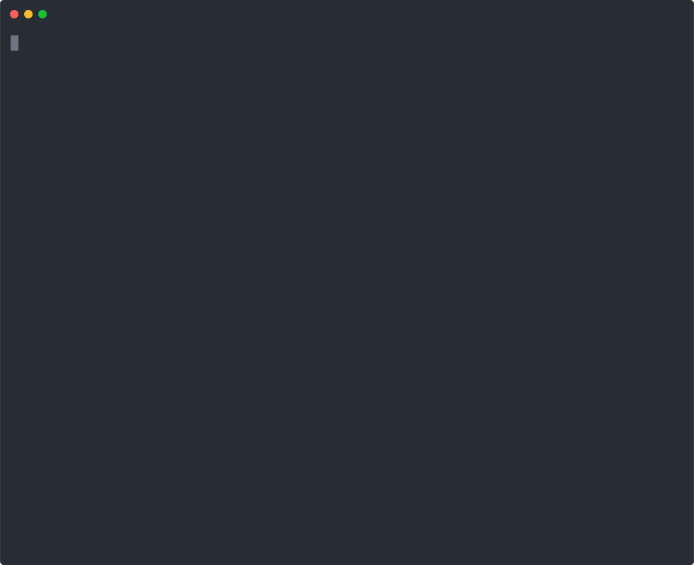

---

## 2. Live FinOps console

`python app/dashboard_app.py` serves a fixed-screen, tabbed console (account id redacted in
these captures).

### Overview — live spend, anomalies, monthly burn
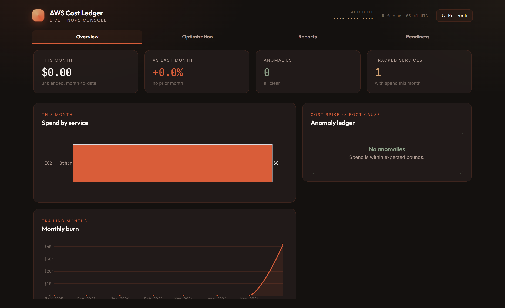

### Optimization — the per-run security / cost / observability scan
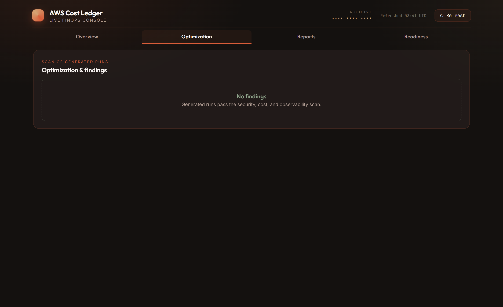

### Reports — every plan-hash-keyed bundle, with links to each section
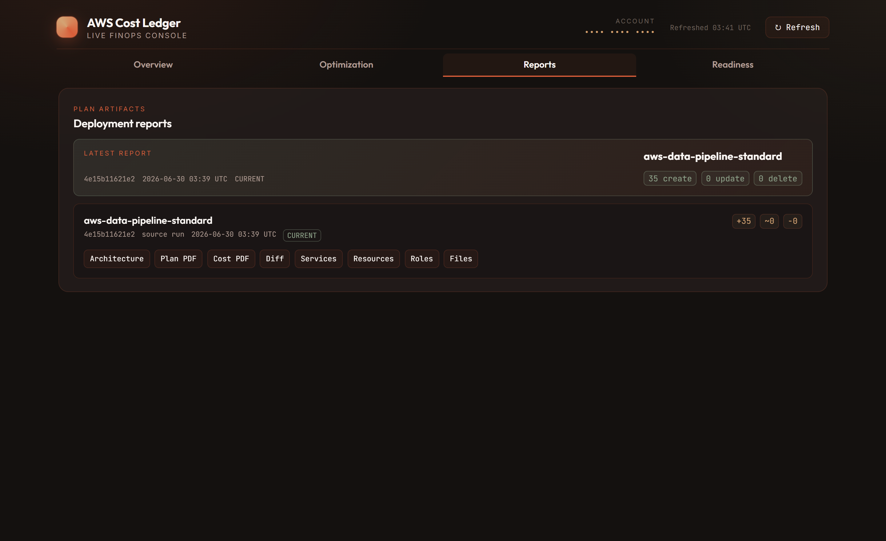

### Readiness — enterprise readiness score per run
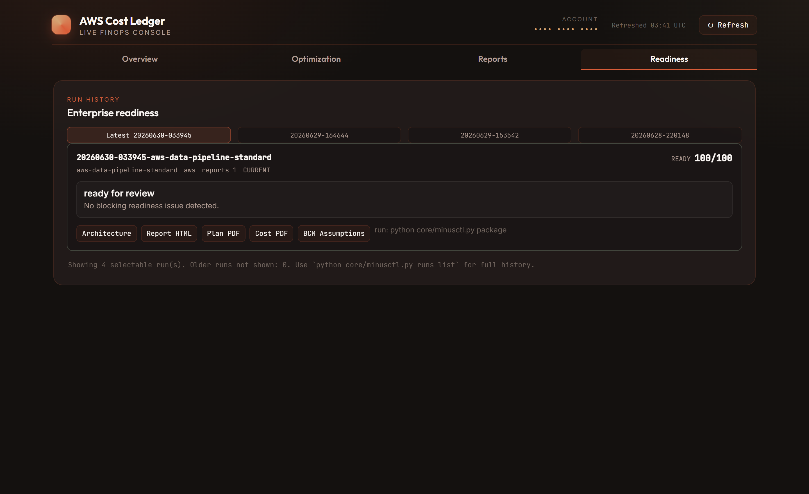

---

## 3. Architecture → Terraform (click-to-code)

The architecture diagram is a real topology: a left-to-right runtime data flow over an
orchestration & governance lane, with KMS locks, a deployment-posture strip, and a finding
overlay. It opens from **Reports → Architecture**.

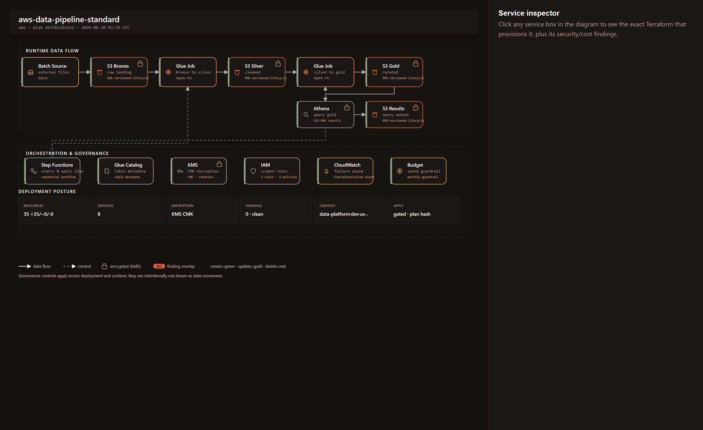

**Click any service box** and the inspector shows the exact plan-bound Terraform that
provisions it — syntax-highlighted — plus that resource's security/cost findings. Here, the
**Glue Job** box opens `glue.tf`:

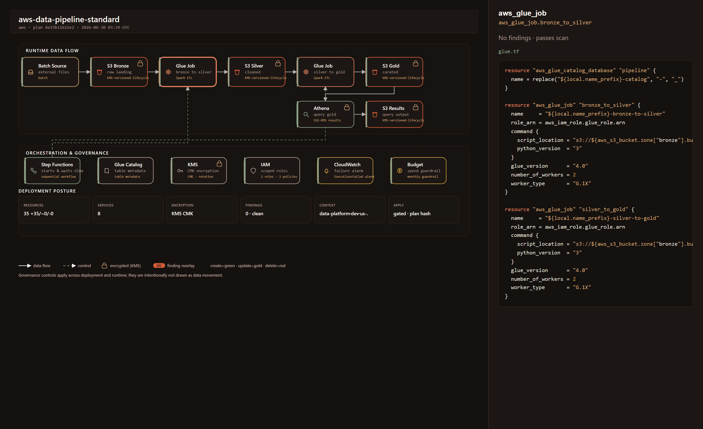

No SaaS diagram tool does this: the picture is bound to the approved plan hash and doubles as
the review surface.

---

## 4. Plan & cost reports

### Plan report
A review artifact (not an apply approval) — the change summary and the explicit reminder that
deployment stays blocked until the plan gate records approval for this exact hash.

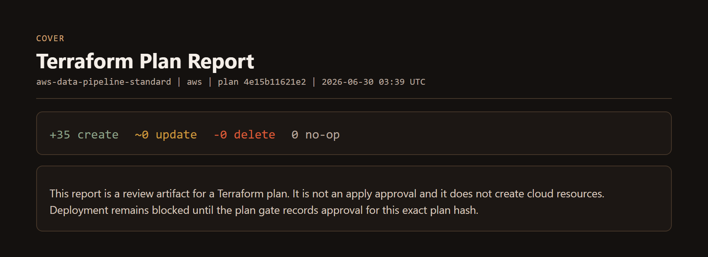

### Cost report — forecast vs. actual
Per-service usage, effective `$/unit` rate, cost drivers, and a **forecast-vs-actual** table
comparing the BCM Pricing Calculator forecast to AWS Cost Explorer actuals.

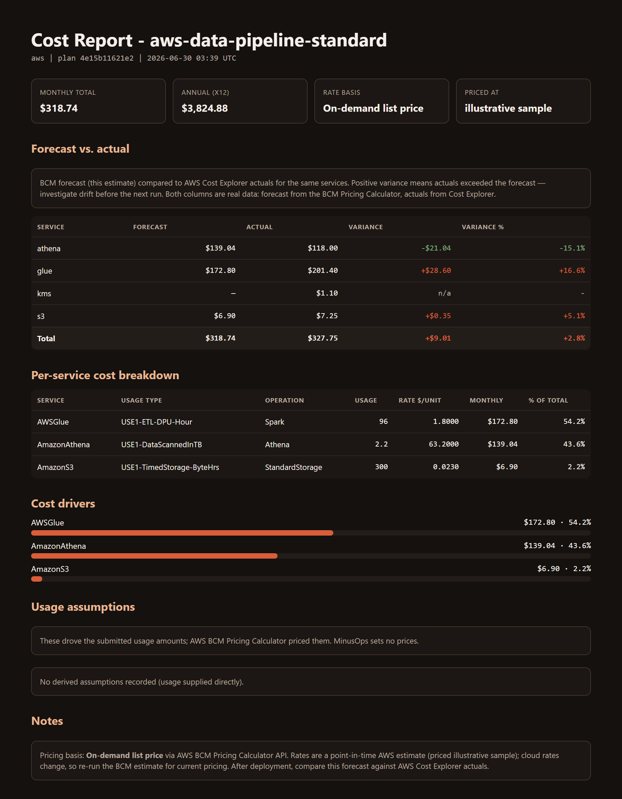

---

## 5. Resources & services

Every planned resource — address, type, action, the service it maps to, and the owning
`.tf` file — and the same data grouped by service.

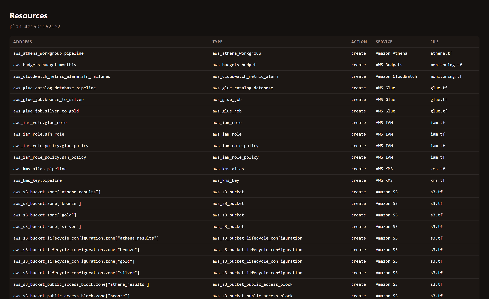
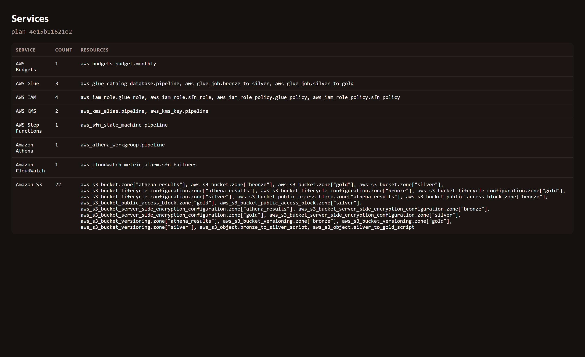

---

<sub>The cost figures above use **illustrative sample** BCM / Cost Explorer data so the report
renders fully offline. Real numbers come only from the AWS BCM Pricing Calculator (forecast)
and Cost Explorer (actuals) — MinusOps never hardcodes a price.</sub>
