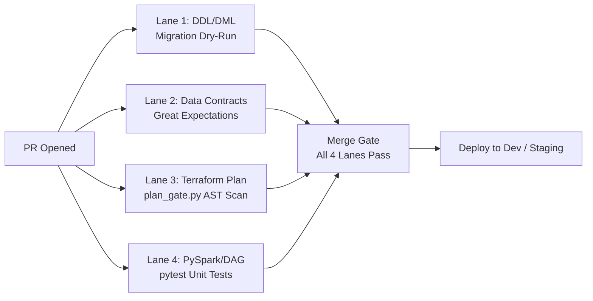

# Product Requirements Document (PRD)
## Enterprise Multi-Project AI Agent Governance, Blast-Radius Isolation & Hierarchical FinOps Control Plane

| Attribute | Details |
| :--- | :--- |
| **Document ID** | PRD-ARCH-2026-001 (Revision 2 - Architect-Harmonized) |
| **Title** | Enterprise Multi-Project Agent Governance & Hierarchical FinOps Control Plane |
| **Lead Architect** | Matt (Architecture & Platform Engineering Lead) |
| **Status** | READY FOR ARCHITECT SIGN-OFF |
| **Target Scope** | Phase 1 (Single-Account Hardened Core) + Phase 2 (Multi-Account Landing Zone Spec) |
| **Date** | 2026-08-21 |

---

## 1. Executive Summary & Problem Statement

### 1.1 The Challenge
In complex global enterprises (e.g., healthcare, life sciences, finance), cloud operations span multiple business domains, each managing dedicated Git repositories for specific functional projects, with each project operating dozens of specialized data pipelines.

Standard AI assistants and naive DevOps tooling suffer from two fatal enterprise flaws:
1. **Flat / Static Budget Blindness:** Naive systems set flat dollar thresholds (e.g. "$500 cap"). Senior leadership (CFO, VP, Directors) cannot use this—they require **Month-over-Month (MoM) Variance Analysis** (e.g. `Last Month: $1,679` -> `Current Month: $2,405`, `+$726 / +43.2% rise`), root-cause cost driver breakdowns, and clear command-chain ownership attribution.
2. **Probabilistic Security & Cross-Repo Blast Radius:** Prompts (`AGENTS.md`) alone cannot prevent AI agents with shell execution from executing destructive teardowns, escalating IAM privileges, or cross-contaminating state across isolated project repositories.

### 1.2 The Solution
MinusOps establishes a **Zero-Trust, Multi-Project Control Plane** delivering:
* **Deterministic 4-Tier Guardrails:** Prompt rules -> Python AST gate -> Terraform `prevent_destroy` -> AWS IAM Permissions Boundary that physically blocks unapproved teardowns and privilege escalation.
* **Hierarchical State Isolation:** Partitioning infrastructure per Domain, Project, and Pipeline.
* **Dual-Workbook FinOps Intelligence:** Automated MoM variance ledgers, percentage rise analytics, and executive spreadsheets (1 single row per project) for leadership reviews.
* **The 7-Pillar Enterprise Grilling Engine:** Interrogating Day-2 architectural requirements (schema drift, idempotency, consumer personas, compute sizing, compliance) before generating IaC.
* **Dynamic Dependency & Compatibility Engine:** Interactive selection of libraries (`polars`, `duckdb`, `pandas`, `pyarrow`) with automated Amazon Linux ABI pre-flight verification.
* **Two-Phase Implementation Phasing:** Phase 1 delivers the single-account hardened governance core; Phase 2 expands to multi-account Landing Zone data mesh topology.

---

## 2. Enterprise Hierarchy & Blast-Radius Isolation Model

```
┌─────────────────────────────────────────────────────────────────────────────┐
│ ENTERPRISE / ORGANIZATION LEVEL                                             │
│ (Global Identity, AWS Organization SCPs, Unified FinOps Ledger)             │
└──────────────────────────────────────┬──────────────────────────────────────┘
                                       │
         ┌─────────────────────────────┴─────────────────────────────┐
         ▼                                                           ▼
┌─────────────────────────────────────────┐ ┌─────────────────────────────────────────┐
│ DOMAIN / BUSINESS UNIT A                │ │ DOMAIN / BUSINESS UNIT B                │
│ (e.g., Domain Analytics & Insights)     │ │ (e.g., Domain Operations & Regulatory)  │
└────────────────────┬────────────────────┘ └────────────────────┬────────────────────┘
                     │                                           │
         ┌───────────┴───────────┐                   ┌───────────┴───────────┐
         ▼                       ▼                   ▼                       ▼
┌─────────────────┐     ┌─────────────────┐ ┌─────────────────┐     ┌─────────────────┐
│ PROJECT REPO 1  │     │ PROJECT REPO 2  │ │ PROJECT REPO 3  │     │ PROJECT REPO 4  │
│ (Dedicated Git) │     │ (Dedicated Git) │ │ (Dedicated Git) │     │ (Dedicated Git) │
└────────┬────────┘     └────────┬────────┘ └────────┬────────┘     └────────┬────────┘
         │                       │                   │                       │
    ┌────┴────┐             ┌────┴────┐         ┌────┴────┐             ┌────┴────┐
    ▼         ▼             ▼         ▼         ▼         ▼             ▼         ▼
┌───────┐ ┌───────┐     ┌───────┐ ┌───────┐ ┌───────┐ ┌───────┐     ┌───────┐ ┌───────┐
│PIPE A1│ │PIPE A2│     │PIPE B1│ │PIPE B2│ │PIPE C1│ │PIPE C2│     │PIPE D1│ │PIPE D2│
└───────┘ └───────┘     └───────┘ └───────┘ └───────┘ └───────┘     └───────┘ └───────┘
```

### 2.1 State Isolation Standard
To guarantee zero cross-workload contamination, state paths are partitioned deterministically:
* **Canonical Remote State Key:**
  `teams/<domain_id>/<project_id>/<workload_id>/terraform.tfstate`
* **Native S3 Locking:** Enforced via `use_lockfile = true` per workload state file (avoiding DynamoDB lock table sprawl).
* **Blast Radius Invariant:** A failure, drift, or destroy operation in `PROJECT REPO 1 / PIPE A1` is cryptographically bounded and cannot mutate or corrupt state in `PROJECT REPO 2`.

### 2.2 Phasing Scope: Single-Account Hardening (Phase 1) vs. Multi-Account Mesh (Phase 2)

| Dimension | Phase 1 (Immediate Scope) | Phase 2 (Target Enterprise Evolution) |
| :--- | :--- | :--- |
| **AWS Account Scope** | Single AWS Account with strict IAM role separation and Workgroup isolation. | Multi-Account AWS Organization (Control Tower / RAM / Hub-and-Spoke Mesh). |
| **Data Access** | Athena Workgroups with dedicated 10 GiB per-query scan caps. | Lake Formation Cross-Account Shares & Central Catalog. |
| **State Partitioning** | S3 bucket directory partitioning (`teams/<domain>/<project>/<workload>/`). | Cross-Account S3 State Bucket with KMS CMK delegation. |

---

## 3. The 4-Tier Zero-Trust Guardrail Architecture

Prompts cannot physically restrain an agent with shell access. MinusOps enforces a **fail-closed 4-tier security architecture** where each outer layer operates independently of the agent's behavior:

```
┌─────────────────────────────────────────────────────────────────────────────┐
│ TIER 1: AGENT INSTRUCTION LEVEL (Soft Boundary)                             │
│ • AGENTS.md Operating Rules & HITL Constraints                              │
├─────────────────────────────────────────────────────────────────────────────┤
│ TIER 2: PYTHON GOVERNANCE GATE ENGINE (Runtime Fail-Closed Boundary)        │
│ • core/governance/plan_gate.py                                              │
│ • Inspects Terraform AST & plan JSON; hard-blocks destroying actions        │
│ • Asserts caller_identity != approved_by (Two-Person STS Rule)             │
├─────────────────────────────────────────────────────────────────────────────┤
│ TIER 3: TERRAFORM ENGINE LEVEL (IaC Immutability Boundary)                  │
│ • lifecycle { prevent_destroy = true } on all stateful resources            │
│ • S3 State Locking (use_lockfile = true)                                    │
├─────────────────────────────────────────────────────────────────────────────┤
│ TIER 4: AWS IAM PERMISSIONS BOUNDARY (Hard Cryptographic Cloud Boundary)   │
│ • MinusOpsAgentConstructionBoundary attached to Agent Runner IAM Role       │
│ • Explicit Deny on s3:DeleteBucket*, kms:Delete*, dynamodb:DeleteTable*     │
│ • StringEquals: iam:PermissionsBoundary enforced on all created roles       │
└─────────────────────────────────────────────────────────────────────────────┘
```

---

## 4. Attributed Variance FinOps Intelligence Model

Flat dollar limits ($500 cap) fail in enterprise operations because workloads scale naturally with business volume. MinusOps replaces static thresholds with **Attributed Month-over-Month (MoM) Variance Intelligence**:

### 4.1 The Variance Equation & Anomaly Trigger
$$\Delta \text{Cost} = \text{Spend}_{\text{Current Month}} - \text{Spend}_{\text{Prior Month}}$$
$$\text{MoM Variance \%} = \left( \frac{\Delta \text{Cost}}{\text{Spend}_{\text{Prior Month}}} \right) \times 100$$

* **Alert Trigger Rule:** If $\text{MoM Variance \%} \ge +20.0\%$ AND $\Delta \text{Cost} \ge \$250.00$, trigger an automated FinOps Investigation Report.

---

## 5. Dual-Workbook Excel Standard & Non-PII Tagging Policy

MinusOps exports **two distinct OpenXML workbooks** via standard library (`core/reporting/excel_finops_generator.py`) with zero third-party dependencies:

### 5.1 File 1: Executive Project Summary (`executive_project_summary.xlsx`)
Exactly **1 single aggregated row per Project/Repository** for CFOs, VPs, and Directors:

| Project / Repository | Business Domain | Current Month ($) | Prior Month ($) | MoM Delta ($) | MoM Variance (%) | Primary Technical Cost Driver | Accountable Lead Role | Cost Center | Action Plan |
| :--- | :--- | :--- | :--- | :--- | :--- | :--- | :--- | :--- | :--- |
| `payer-reconciliation-pipeline` | Domain Analytics | $2,405.80 | $1,679.50 | +$726.30 | **+43.2%** | Glue Spark DPU scaling (file spike) | `payer-recon-lead` | `CC-4092` | Add file batching & tune worker count |
| `clinical-trials-lakehouse` | Domain Regulatory | $4,890.10 | $4,750.00 | +$140.10 | +2.9% | Normal S3 Gold data accumulation | `clinical-data-lead` | `CC-1088` | Healthy growth within baseline |

### 5.2 File 2: Granular Engineering Ledger (`pipeline_detailed_ledger.xlsx`)
Granular component breakdown for Data Engineers and FinOps Auditors (Glue DPU hours, S3 GB-months, Athena bytes scanned).

### 5.3 Mandatory Non-PII Tagging Policy & Brownfield Grandfathering
To prevent PII leakage into Cost Explorer, CloudTrail, and billing exports, **email addresses are strictly forbidden in resource tags**. Ownership is identified by role/team aliases and resolved to humans out-of-band:

```hcl
tags = {
  TeamId      = "data-platform-recon"       # Team/Project identifier
  OwnerRole   = "payer-reconciliation-lead" # Role alias (zero personal email)
  Domain      = "domain-analytics"          # Business domain
  CostCenter  = "CC-4092"                   # Finance chargeback code
  Environment = "prod"                      # dev | staging | prod
  ManagedBy   = "minusops"                  # Control plane origin
}
```

* **Brownfield Grandfathering Policy:** Existing adopted infrastructure (`adopt.py --policy-mode brownfield`) is grandfathered with warnings on missing legacy tags, requiring only `TeamId` and `ManagedBy`. Greenfield deployments (`--policy-mode production`) strictly enforce all 6 tags.

---

## 6. The 7-Pillar Architectural Grilling Framework

Before generating any IaC, MinusOps interviews the architect across **7 fundamental architectural pillars**:

```
┌─────────────────────────────────────────────────────────────────────────────┐
│ 1. INGESTION & SOURCE PROTOCOL (Volume, Cadence, Multi-Sheet File Handling) │
│ 2. SCHEMA EVOLUTION & DATA CONTRACTS (Nullability, Casing, Contract Enforce)│
│ 3. IDEMPOTENCY, PARTITIONING & DEDUPLICATION (Deterministic Partition Keys) │
│ 4. COMPUTE SIZING & ENGINE (Serverless Glue 4.0 vs Managed EMR vs Athena)   │
│ 5. DOWNSTREAM CONSUMER PERSONAS & COST CAPS (Athena 10 GiB Scan Cutoffs)    │
│ 6. OBSERVABILITY, QUARANTINE & DLQ (Error Trapping, Dead-Letter Buckets)    │
│ 7. GOVERNANCE, ENCRYPTION & COMPLIANCE (S3 Governance WORM + Crypto-Shred)  │
└─────────────────────────────────────────────────────────────────────────────┘
```

### 6.1 Dynamic Python Library Discovery (No Hardcoding)
MinusOps never hardcodes a fixed library set. It interactively queries the engineer's stack requirements (`polars`, `duckdb`, `pandas`, `openpyxl`, `dbt`) and automatically validates that wheels match the target runtime (`AWS Glue 4.0 / Python 3.10` or `EMR 7.0 / Python 3.11`) using `doctor.py` ABI bytecode checks before S3 upload.

### 6.2 3-Tier Environment Lifecycle (`dev` -> `staging` -> `prod`)
MinusOps aligns with the enterprise 3-tier lifecycle:
* **Dev (Sandbox):** Data engineers rapid experimentation with synthetic data; single-operator self-approval allowed.
* **Staging (QA / UAT):** Automated integration tests + downstream business analyst acceptance on masked data.
* **Production:** Immutable live execution; **Two-Person STS Rule** ($\text{Planner} \neq \text{Approver}$) + Hardware MFA required.

---

## 7. The 5-Stage Infrastructure Lifecycle & Deliverable Artifacts

Every infrastructure change follows a deterministic 5-stage lifecycle producing audited artifacts in `runs/<run-id>/`:

```
┌─────────────────────────────────────────────────────────────────────────────┐
│ STAGE 1: REQUIREMENTS DISCOVERY -> runs/<run-id>/requirements.json          │
│ STAGE 2: ARCHITECTURE DECISION  -> runs/<run-id>/architecture_decision.json │
│ STAGE 3: HCL SYNTHESIS & SCAN  -> runs/<run-id>/terraform/ + scan_report.md │
│ STAGE 4: PLAN-BOUND DEPLOY GATE -> runs/<run-id>/plan_hash.json + approval.json│
│ STAGE 5: POST-DEPLOY FINOPS  -> executive_project_summary.xlsx + audit.jsonl│
└─────────────────────────────────────────────────────────────────────────────┘
```

---

## 8. Regulatory Compliance, WORM Immutability & GDPR Erasure

### 8.1 Resolving the Legal Tension (SEC 17a-4 Immutability vs. GDPR Right-to-be-Forgotten)
Standard S3 Object Lock `COMPLIANCE` mode makes deletion impossible for anyone including root, directly conflicting with GDPR Article 17 erasure requests. MinusOps resolves this legal conflict via **Pseudonymization & Crypto-Shredding**:

```
┌─────────────────────────────────────────────────────────────────────────────┐
│ INGESTION: Salted Hash Tokenization                                         │
│ • Raw Bronze data stores only pseudonymized tokens: `patient_token_8f9a2`   │
│ • Direct PII is encrypted with a dedicated per-patient / per-batch KMS Key. │
├─────────────────────────────────────────────────────────────────────────────┤
│ IMMUTABILITY: S3 Object Lock in GOVERNANCE Mode                             │
│ • Bronze buckets use S3 Object Lock in GOVERNANCE mode (MFA-protected lock) │
│ • Prevents accidental deletion while allowing authorized legal compliance.  │
├─────────────────────────────────────────────────────────────────────────────┤
│ GDPR ERASURE EXECUTION (Crypto-Shredding):                                  │
│ 1. Silver / Gold Iceberg: Execute row delete: `DELETE FROM tbl_gold ...`    │
│ 2. Bronze WORM: Destroy the specific KMS encryption key in AWS KMS.         │
│ -> The Bronze ciphertext becomes mathematically unrecoverable white noise,  │
│   satisfying both SEC 17a-4 immutability and GDPR Art. 17 erasure laws!     │
└─────────────────────────────────────────────────────────────────────────────┘
```

---

## 9. Disaster Recovery (DR) & Multi-Region Replay

### 9.1 Achievable Recovery Objectives (SLAs)
* **Recovery Point Objective (RPO):** `< 15 minutes` — Enabled via **S3 Replication Time Control (S3 RTC)** with CloudWatch replication lag alarms.
* **Recovery Time Objective (RTO):** `< 2 hours` — Built on **Pilot Light / Warm Standby** (Terraform pre-provisions Catalogs, IAM roles, and S3 replica buckets in the DR region; compute triggers upon failover).

### 9.2 Zero-Data-Loss Lakehouse Replay Runbook
If Gold tables are corrupted by an errant transformation:
1. **Quarantine State:** Abort active Step Functions execution.
2. **Replay Trigger:** Execute the deterministic replay job:
   `python core/reporting/seed.py --run <run-id>`
3. **Deterministic Re-Processing:** PySpark reads the immutable Bronze bucket and deterministically re-materializes all Silver and Gold Iceberg partitions.

---

## 10. CI/CD Environment Promotion, Team Personas & Incident Remediation

### 10.1 The 4-Lane Parallel Pre-Merge PR Validation Workflow
Every Pull Request runs 4 independent lanes in parallel before merging:



### 10.2 The Reusable "Feed-Factory" Architecture
Teams onboarding a new vendor feed check in a single configuration file without writing bespoke CI/CD pipelines:

```yaml
# feeds/payer_feed_01.yaml
feed_id: "payer-reconciliation-01"
domain: "domain-analytics"
source_s3_prefix: "inbound/payers/vendor_a/"
schedule_cron: "0 8 * * ? *"
schema_contract: "contracts/payers/v1_schema.json"
compute_engine: "glue-spark-4.0"
max_worker_capacity: 4
cost_center: "CC-4092"
owner_role: "payer-reconciliation-lead"
```

### 10.3 The 3 Incident Remediation Pathways
1. **Standard / Structural Fix:** `dev` -> `staging (UAT validation)` -> `prod`.
2. **Fast-Track Staging Hotfix:** Branch `hotfix/*` -> validate query/script in `staging` with end-users -> promote to `prod` with Lead approval.
3. **Zero-Downtime Table Rollback:** Apache Iceberg Time-Travel snapshot rollback (`CALL system.rollback_to_snapshot('gold_table', snapshot_id)`).

---

## 11. FinOps Circuit Breakers & Automated Cost Remediation

* **Athena Query Guard:** `BytesScannedCutoffPerQuery = 10737418240` (10 GiB = ~$0.05 cutoff per query).
* **Glue Job Worker Cap:** `max_capacity = 4`, `Timeout = 120` minutes.
* **S3 Lifecycle Tiering:** Transition Standard -> Glacier Instant Retrieval at 30 days -> Deep Archive at 90 days ($0.00099/GB-mo).

---

## 12. Failure Mode Analysis (TerraShark & Data Pipeline Mitigations)

### 12.1 Canonical Architectural Failure Modes (Enforced by `architecture_decision.py`)

| Code | Canonical Failure Mode | MinusOps Pre-Flight Mitigation |
| :--- | :--- | :--- |
| **FM-01** | **Identity Churn** (count indexing, missing `moved {}` blocks, plan-unknown keys) | Enforces `for_each` over stable keys; generates `moved` blocks during module refactors. |
| **FM-02** | **Secret Exposure** (hardcoded defaults, state/log leakage, raw plan JSON in CI) | Resolves credentials via AWS Secrets Manager ARNs; suppresses secrets in CI outputs. |
| **FM-03** | **Blast Radius** (monolithic root modules, shared state across envs, missing locks) | Hierarchical remote state paths (`teams/<d>/<p>/<w>/`) with native S3 state locking. |
| **FM-04** | **CI Drift** (floating versions, uncommitted lock file, re-planning at apply time) | Pinned `.terraform.lock.hcl` + SHA-256 plan-hash bound deployment gate. |
| **FM-05** | **Compliance Gate Gaps** (static docs instead of CI policy gates, blanket `ignore_changes`) | 4-Tier Zero-Trust Guardrails (AST verify + checkov/tfsec scan + Two-Person STS Rule). |

### 12.2 Data Pipeline Execution Circuit Breakers
* **High-Cardinality Partition Explosion:** Dynamic partition validation restricting columns to date/region.
* **S3 Schema Drift & Unquoted Comma Ingestion:** Pydantic schema contracts routing malformed rows to Quarantine.
* **Runaway Athena Query Costs:** Hard 10 GiB per-query scan cutoffs enforced at the Workgroup level.
* **Runaway Glue Job Execution:** Hard 120-minute execution timeout (`timeout = var.timeout_minutes`) on all Glue Spark jobs.

---

## 13. Production AWS IAM Permissions Boundary Specification

To guarantee that the agent runner cannot escalate privileges or bypass governance, MinusOps attaches the following **fail-closed Permissions Boundary** to the Agent Runner Role:

```json
{
  "Version": "2012-10-17",
  "Statement": [
    {
      "Sid": "AllowGovernedInfrastructureCreation",
      "Effect": "Allow",
      "Action": [
        "s3:CreateBucket",
        "s3:PutObject",
        "s3:GetObject",
        "s3:ListBucket",
        "s3:PutBucketVersioning",
        "s3:PutBucketEncryption",
        "s3:PutLifecycleConfiguration",
        "glue:CreateDatabase",
        "glue:CreateTable",
        "glue:CreateJob",
        "glue:Get*",
        "glue:List*",
        "states:CreateStateMachine",
        "states:Describe*",
        "athena:CreateWorkGroup",
        "athena:Get*",
        "iam:Get*",
        "iam:List*",
        "iam:PassRole"
      ],
      "Resource": "*",
      "Condition": {
        "StringEquals": {
          "aws:RequestedRegion": ["us-east-1", "us-west-2"]
        }
      }
    },
    {
      "Sid": "AllowManagedRoleCreationWithStrictBoundary",
      "Effect": "Allow",
      "Action": [
        "iam:CreateRole",
        "iam:PutRolePolicy",
        "iam:AttachRolePolicy",
        "iam:DetachRolePolicy"
      ],
      "Resource": "arn:aws:iam::*:role/minusops-*",
      "Condition": {
        "StringEquals": {
          "iam:PermissionsBoundary": "arn:aws:iam::*:policy/MinusOpsWorkloadExecutionBoundary"
        }
      }
    },
    {
      "Sid": "DenyDestructiveInfrastructureDeletes",
      "Effect": "Deny",
      "Action": [
        "s3:DeleteBucket*",
        "kms:ScheduleKeyDeletion",
        "kms:Delete*",
        "dynamodb:DeleteTable",
        "iam:DeleteRolePermissionsBoundary"
      ],
      "Resource": "*"
    },
    {
      "Sid": "DenyPrivilegeEscalationOnKeysAndPolicies",
      "Effect": "Deny",
      "Action": [
        "kms:PutKeyPolicy",
        "s3:PutBucketPolicy",
        "iam:CreatePolicyVersion"
      ],
      "Resource": "*"
    }
  ]
}
```

---

## 14. Functional Requirements (FR)

* **FR-01 (Multi-Project State Isolation):** Deterministic state isolation scoped per Domain, Project, and Workload.
* **FR-02 (Deterministic Guardrails):** AST scan and IAM Permissions Boundary blocking destructive teardowns.
* **FR-03 (Two-Person Rule):** Enforce `caller_identity != approved_by` in Staging and Production.
* **FR-04 (Attributed MoM Variance):** Compute dollar and percentage variance with cost driver attribution.
* **FR-05 (Dual-Workbook FinOps):** Pure-Python OpenXML generator producing Executive Summary (1 row/project) and Granular Ledger.
* **FR-06 (7-Pillar Grilling Engine):** Interrogate 7 architectural dimensions before HCL synthesis.
* **FR-07 (Crypto-Shredding Compliance):** Support S3 Object Lock in Governance mode with key crypto-shredding for GDPR.
* **FR-08 (Feed-Factory CI/CD):** Reusable `workflow_call` template parameterized by per-feed YAML config.
* **FR-09 (Dynamic Dependency Verification):** Interactive package resolution with pre-flight ABI bytecode verification (`doctor.py`).

---

## 15. Non-Functional Requirements (ISO 25010)

* **Security:** Zero plaintext credentials in state; zero wildcard `Resource = "*"` on S3/KMS; zero personal PII in resource tags.
* **Performance:** Excel FinOps generator executes in $< 1.5\text{s}$ with zero external dependencies.
* **Reliability & DR:** S3 RTC guarantees RPO $< 15\text{m}$; Warm Standby guarantees RTO $< 2\text{h}$.
* **Auditability:** Every plan hash, approval STS identity, and applied change is immutably appended to `.agents/logs/audit.jsonl`.

---

## 16. Architectural Decisions & Defaults (Matt Sign-Off)

| Decision Item | Approved Default Standard | Architectural Rationale |
| :--- | :--- | :--- |
| **Decision 1: Tagging Policy** | **Grandfathered Adoption Mode:** Strict 6 tags on new pipelines; `--policy-mode brownfield` requires only `TeamId` + `ManagedBy`. | Enables adopting brownfield enterprise infrastructure without breaking pre-existing pipelines. |
| **Decision 2: IAM Boundary** | **2-Tier Boundary:** Agent Runner Role Boundary (no delete) vs Workload Execution Role Boundary (allows Iceberg compaction deletes). | Eliminates circular dependency preventing Iceberg/S3 lifecycle deletions. |
| **Decision 3: FinOps Cadence** | **Weekly Scheduled Ledger + MoM Threshold Trigger ($\ge +20\%$).** | Balances executive visibility without generating notification fatigue. |
| **Decision 4: Object Lock Mode** | **GOVERNANCE Mode with Crypto-Shredding Architecture.** | Satisfies both SEC 17a-4 immutability and GDPR Art. 17 right-to-be-forgotten without stranding buckets. |
| **Decision 5: Break-Glass Rule** | **Dual-STS Hardware MFA with Automated SecOps Alarm.** | Allows emergency incident remediation while preserving an unalterable audit trail. |

---

## 17. Verification & Acceptance Test Plan

### 17.1 Phase 1: Verified Invariants (Passed Unit & Governance Tests)
* [x] **AST Destructive Change Blocking:** `tests/test_destructive_governance.py` validates fail-closed block on destroy plans.
* [x] **Plan-Gate Invariant Checks:** `tests/test_plan_gate.py` verifies plan-hash immutability and approval validation.
* [x] **Dual-Workbook Generation:** Verified OpenXML generation of `executive_project_summary.xlsx` and `pipeline_detailed_ledger.xlsx`.

### 17.2 Phase 2: Target Acceptance Benchmarks (To be verified on Live AWS)
* [ ] **S3 RTC Replication Benchmark:** Measure cross-region replication lag under a 10 GiB burst to verify RPO $< 15\text{m}$.
* [ ] **Disaster Recovery Replay Benchmark:** Execute `seed.py` to re-materialize Gold tables within $< 120\text{m}$.
* [ ] **Pre-Flight ABI Verification:** Verify `doctor.py` bytecode validation against Amazon Linux 2023 wheels.
