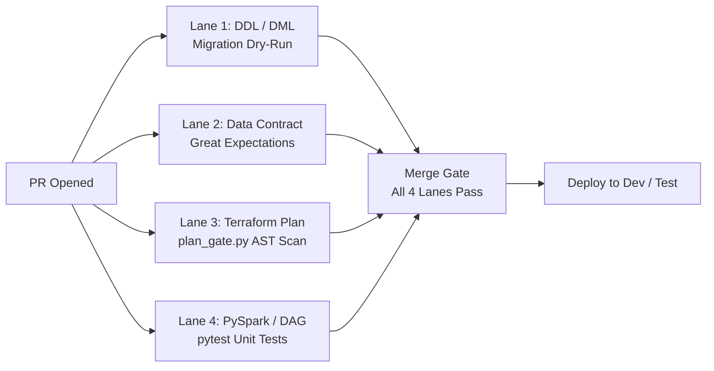

# Product Requirements Document (PRD)
## Enterprise Multi-Project AI Agent Governance, Blast-Radius Isolation & Hierarchical FinOps Architecture

| Attribute | Details |
| :--- | :--- |
| **Document ID** | PRD-ARCH-2026-001 |
| **Title** | Enterprise Multi-Project Agent Governance & Hierarchical FinOps Control Plane |
| **Target Reviewer** | Matt (Architecture & Platform Engineering Lead) |
| **Author** | Platform Engineering / Security Architecture |
| **Status** | DRAFT FOR ARCHITECTURE REVIEW |
| **Date** | 2026-08-20 |
| **Target System** | MinusOps Control Plane & Multi-Project Governance Fabric |

---

## 1. Executive Summary & Problem Statement

### 1.1 The Challenge
In complex global enterprises (e.g., healthcare, life sciences, finance), cloud operations are organized into multiple business domains, each managing dedicated Git repositories for specific functional projects, with each project operating dozens of specialized data pipelines.

Standard AI assistants and naive DevOps tooling suffer from two fatal enterprise flaws:
1. **Flat / Static Budget Blindness:** Naive systems set flat dollar thresholds (e.g. "$500 cap"). Senior leadership (CFO, VP, Directors) cannot use this—they require **Month-over-Month (MoM) Variance Analysis** (e.g. `Last Month: $1,679` ➔ `Current Month: $2,405`, `+$726 / +43.2% rise`), root-cause cost driver breakdowns, and clear command-chain ownership attribution.
2. **Probabilistic Security & Cross-Repo Blast Radius:** Prompts (`AGENTS.md`) alone cannot prevent AI agents with shell execution from executing destructive teardowns, escalating IAM privileges, or cross-contaminating state across isolated project repositories.

### 1.2 The Solution
MinusOps establishes a **Zero-Trust, Multi-Project Control Plane** providing:
* **Deterministic 4-Tier Guardrails** that physically block unapproved teardowns and privilege escalation.
* **Hierarchical Multi-Project State Isolation** partitioning infrastructure per Domain, Repository, and Pipeline.
* **Dual-Workbook FinOps Intelligence** delivering automated MoM variance ledgers, percentage rise analytics, and executive spreadsheets (1 single row per project) for leadership reviews.
* **9-Pillar Enterprise Grilling Engine** discovering deep Day-2 architectural requirements (schema drift, idempotency, consumer personas, multi-account topology) before generating a single line of IaC.
* **4-Tier Environment Lifecycle & Runtime Packaging Matrix** governing Dev, Test, UAT, and Prod with pinned Spark/Python compatibility.

---

## 2. Enterprise Hierarchy & Blast-Radius Isolation Model

```
┌─────────────────────────────────────────────────────────────────────────────┐
│ ENTERPRISE / ORGANIZATION LEVEL                                             │
│ (Global Identity, AWS Organization SCPs, Unified FinOps Ledger)             │
└──────────────────────────────────────┬──────────────────────────────────────┘
                                       │
         ┌─────────────────────────────┴─────────────────────────────┐
         ▼                                                           ▼
┌─────────────────────────────────────────┐ ┌─────────────────────────────────────────┐
│ DOMAIN / BUSINESS UNIT A                │ │ DOMAIN / BUSINESS UNIT B                │
│ (e.g., Domain Analytics & Insights)     │ │ (e.g., Domain Operations & Regulatory)  │
└────────────────────┬────────────────────┘ └────────────────────┬────────────────────┘
                     │                                           │
         ┌───────────┴───────────┐                   ┌───────────┴───────────┐
         ▼                       ▼                   ▼                       ▼
┌─────────────────┐     ┌─────────────────┐ ┌─────────────────┐     ┌─────────────────┐
│ PROJECT REPO 1  │     │ PROJECT REPO 2  │ │ PROJECT REPO 3  │     │ PROJECT REPO 4  │
│ (Dedicated Git) │     │ (Dedicated Git) │ │ (Dedicated Git) │     │ (Dedicated Git) │
└────────┬────────┘     └────────┬────────┘ └────────┬────────┘     └────────┬────────┘
         │                       │                   │                       │
    ┌────┴────┐             ┌────┴────┐         ┌────┴────┐             ┌────┴────┐
    ▼         ▼             ▼         ▼         ▼         ▼             ▼         ▼
┌───────┐ ┌───────┐     ┌───────┐ ┌───────┐ ┌───────┐ ┌───────┐     ┌───────┐ ┌───────┐
│PIPE A1│ │PIPE A2│     │PIPE B1│ │PIPE B2│ │PIPE C1│ │PIPE C2│     │PIPE D1│ │PIPE D2│
└───────┘ └───────┘     └───────┘ └───────┘ └───────┘ └───────┘     └───────┘ └───────┘
```

### 2.1 State Isolation Standard
To guarantee zero cross-workload contamination:
* **State Partitioning:**
  `s3://<governance-state-bucket>/state/<domain_id>/<project_repo_id>/<pipeline_id>/terraform.tfstate`
* **Native S3 Locking:** Enforced via `use_lockfile = true` per workload state file.
* **Blast Radius Invariant:** A failure, drift, or destroy operation in `PROJECT REPO 1 / PIPE A1` is cryptographically bounded and cannot mutate or corrupt state in `PROJECT REPO 2`.

### 2.2 AWS Multi-Account Landing Zone Topology (Hub-and-Spoke Data Mesh)

```
┌─────────────────────────────────────────────────────────────────────────────┐
│ CENTRAL AWS ORGANIZATION (Control Tower Landing Zone)                       │
│                                                                             │
│ ┌───────────────────────────────┐     ┌───────────────────────────────────┐ │
│ │ ACCOUNT 1: DATA LAKE HUB      │     │ ACCOUNT 2: ETL & COMPUTE SPOKE    │ │
│ │ • S3 Medallion (Bronze/Silver/│◄───►│ • AWS Glue 4.0 Spark Jobs         │ │
│ │   Gold/Quarantine)            │(RAM)│ • AWS Step Functions State Machines│ │
│ │ • Customer Managed KMS CMK    │     │ • Amazon VPC & NAT Gateway Fabric │ │
│ │ • Glue Data Catalog (Central) │     │ • SQS Buffers & EventBridge Rules │ │
│ │ • S3 Object Lock & WORM Retention   └───────────────────────────────────┘ │
│ └───────────────┬───────────────┘                                           │
│                 │                                                           │
│                 │ (Lake Formation Cross-Account Shares)                     │
│                 ▼                                                           │
│ ┌───────────────────────────────────┐ ┌───────────────────────────────────┐ │
│ │ ACCOUNT 3: ANALYTICS & BI SPOKE   │ │ ACCOUNT 4: DATA SCIENCE SPOKE     │ │
│ │ • Athena Workgroups (10 GiB Caps) │ │ • Amazon SageMaker & Notebooks    │ │
│ │ • Tableau / PowerBI IAM Roles     │ │ • ML Feature Store Direct S3 Read │ │
│ │ • Dynamic Column-Level Masking    │ │ • Model Training Dedicated Quotas │ │
│ └───────────────────────────────────┘ └───────────────────────────────────┘ │
└─────────────────────────────────────────────────────────────────────────────┘
```

---

## 3. The 4-Tier Zero-Trust Guardrail Architecture

```
┌─────────────────────────────────────────────────────────────────────────────┐
│ TIER 1: PROCESS & TTY LEVEL (OS / Python Runtime)                           │
│ • sys.stdin.isatty() check: Piped agent subprocesses cannot fake a TTY.    │
│ • Non-interactive execution of destructive applies is hard-aborted.         │
└──────────────────────────────────────┬──────────────────────────────────────┘
                                       │
                                       ▼
┌─────────────────────────────────────────────────────────────────────────────┐
│ TIER 2: GOVERNANCE ENGINE LEVEL (plan_gate.py & destructive_change_gate.py) │
│ • auto-approve is physically blocked in Python for all teardowns/deletions. │
│ • Zero bypass flags exist in production or dev modes.                       │
└──────────────────────────────────────┬──────────────────────────────────────┘
                                       │
                                       ▼
┌─────────────────────────────────────────────────────────────────────────────┐
│ TIER 3: TERRAFORM CORE & HCL LEVEL (prevent_destroy & ForceNew Guards)       │
│ • HCL emits lifecycle.prevent_destroy = true for stateful/gold lake tiers.   │
│ • Terraform core binary halts before planning destruction.                  │
└──────────────────────────────────────┬──────────────────────────────────────┘
                                       │
                                       ▼
┌─────────────────────────────────────────────────────────────────────────────┐
│ TIER 4: AWS CLOUD IAM LEVEL (Permissions Boundary & MFA Condition)          │
│ • Agent runner role has "Construction-Only" (Read + Create, Deny Delete).   │
│ • iam:CreateRole strictly requires iam:PermissionsBoundary attachment.     │
│ • Mutating production role requires aws:MultiFactorAuthPresent: true.       │
└─────────────────────────────────────────────────────────────────────────────┘
```

---

## 4. Hierarchical FinOps Intelligence & Command-Chain Attribution

### 4.1 The Enterprise Variance Model
Instead of arbitrary static thresholds, MinusOps models cost governance around **Attributed Variance Analytics**:
1. **Baseline vs. Actual Spend:** `Last Month ($)` vs. `Current Month ($)` ➔ `Dollar Delta ($)` + `Percentage Rise (%)`.
2. **Command-Chain Attribution:** Every dollar must map to an accountable Domain Lead, Engineering Manager, Cost Center, and Repository.
3. **Unit Cost Drivers:** Pinpoints the exact operational reason for expenditure shifts (e.g. Glue DPU hours scaled +45GB surge vs. unpartitioned Athena scans vs. idle NAT traffic).

---

## 5. Dual-Workbook Executive & Engineering Reporting Specification

MinusOps automatically generates **TWO distinct Excel workbooks (`.xlsx`)** to serve the separate needs of executive leadership vs. engineering teams:

```
┌─────────────────────────────────────────────────────────────────────────────┐
│ FILE 1: executive_project_summary.xlsx (FOR HIGHER-UPS / C-SUITE)           │
│ • Audience: CFO, VP of Engineering, Domain Directors.                       │
│ • Format: Exactly 1 SINGLE ROW PER PROJECT REPOSITORY.                      │
│ • Contents: Aggregated project spend, MoM delta $, % rise, executive reason,│
│             accountable lead, and leadership action plan.                   │
├─────────────────────────────────────────────────────────────────────────────┤
│ FILE 2: pipeline_detailed_ledger.xlsx (FOR DATA ENGINEERS / FINOPS AUDIT)   │
│ • Audience: Data Engineers, DevOps Leads, FinOps Analysts.                  │
│ • Format: Granular breakdown per individual pipeline & cloud service.       │
│ • Contents: Component-by-component root causes, DPU hours, S3 storage TB,   │
│             query scan limits, and specific technical remediation steps.    │
└─────────────────────────────────────────────────────────────────────────────┘
```

### 5.1 File 1 Reference Example: Executive Project Summary (1 Row Per Project)
*Example of the leadership report generated at `artifacts/reports/executive_project_summary.xlsx`:*

| Business Domain | Project / Repository | Active Pipelines | Last Mo ($) | Curr Mo ($) | MoM Delta ($) | MoM Rise (%) | Cost Center | Project Lead | Primary Executive Reason / Cost Driver | Leadership Action Plan & Remediation | Health Status |
| :--- | :--- | :---: | :---: | :---: | :---: | :---: | :---: | :--- | :--- | :--- | :---: |
| **Domain Analytics** | `payer-reconciliation-engine` | 3 | $1,410.00 | $2,136.00 | **+$726.00** | **+51.5%** | `CC-4092` | Sarah T. | Glue Spark ETL surge (+45GB/day data) + S3 Bronze retention lag | Enforce 4-worker cap + 30-day Glacier lifecycle policy | ⚠️ REVIEW REQUIRED |
| **Domain Regulatory** | `claims-audit-pipeline` | 2 | $665.00 | $663.00 | **-$2.00** | **-0.3%** | `CC-8810` | Elena R. | Stable execution; S3 Deep Archive transitions offset minor compute growth | Optimized; maintain current archiving lifecycle rules | ✅ HEALTHY |
| **Domain Core Ops** | `enterprise-vpc-fabric` | 1 | $269.00 | $269.00 | **$0.00** | **0.0%** | `CC-1001` | David K. | Base idle network standing cost (S3 Gateway endpoint eliminates data fees) | Maintain S3 Gateway VPC endpoints | ✅ HEALTHY |

---

### 5.2 File 2 Reference Example: Granular Pipeline Detailed Ledger (Engineering Deep-Dive)
*Example of the engineering audit ledger generated at `artifacts/reports/pipeline_detailed_ledger.xlsx`:*

| Business Domain | Project Repo | Pipeline Identifier | Service Component | Last Mo ($) | Curr Mo ($) | Delta ($) | Rise (%) | Cost Center | Technical Lead | Detailed Root Cause & Workload Driver | Technical Remediation Plan |
| :--- | :--- | :--- | :--- | :---: | :---: | :---: | :---: | :---: | :--- | :--- | :--- |
| `Domain-Analytics` | `payer-engine` | `excel-ingest` | AWS Glue 4.0 (Spark) | $820.00 | $1,332.00 | **+$512.00** | **+62.4%** | `CC-4092` | Sarah T. | Daily volume surged +45GB/day; autoscaling unconstrained | Enforce `max_capacity = 4` worker ceiling |
| `Domain-Analytics` | `payer-engine` | `excel-ingest` | Amazon S3 Lakehouse | $410.00 | $550.00 | **+$140.00** | **+34.1%** | `CC-4092` | Sarah T. | Raw bronze drops > 90 days without Glacier transition | Enforce 30-day Glacier transition rule |
| `Domain-Analytics` | `payer-engine` | `bi-queries` | Amazon Athena | $180.00 | $254.00 | **+$74.00** | **+41.1%** | `CC-4092` | Alex M. | Analysts running full table scans on raw Bronze | Enforce 10 GiB per-query scan cap |
| `Domain-Regulatory` | `claims-audit` | `daily-claims` | AWS Step Functions | $45.00 | $48.00 | **+$3.00** | **+6.6%** | `CC-8810` | Elena R. | Normal execution volume increase | Healthy; no action needed |
| `Domain-Regulatory` | `claims-audit` | `daily-claims` | Amazon S3 Storage | $620.00 | $615.00 | **-$5.00** | **-0.8%** | `CC-8810` | Elena R. | Deep Archive lifecycle rules active | Optimized; maintain current rules |
| `Domain-CoreOps` | `vpc-fabric` | `shared-nat` | Amazon VPC / NAT | $269.00 | $269.00 | **$0.00** | **0.0%** | `CC-1001` | David K. | Base idle network standing cost | S3 Gateway VPC endpoints keep traffic free |

---

### 5.3 Mandatory Tagging Standard (Enforced via AST Scan Rule `SEC-06`)
Every Terraform resource synthesized across all project repositories must include the standardized attribution schema:

| Tag Key | Example Value | Purpose |
| :--- | :--- | :--- |
| `Domain` | `domain-analytics` | Top-level Business Domain / VP Org |
| `ProjectRepo` | `payer-reconciliation-engine` | Dedicated Repository / Project identifier |
| `Pipeline` | `excel-ingestion-medallion` | Specific pipeline / workload identifier |
| `CostCenter` | `CC-4092` | General Ledger accounting code |
| `Owner` | `sarah.t@company.com` | Accountable technical/business lead |
| `Environment` | `production` | `dev`, `staging`, or `production` |

---

## 6. The 9-Pillar Enterprise Architectural Grilling & Infrastructure Sizing Framework

Before generating any infrastructure code, the `grill-me` skill conducts an interactive interrogation across the **9 Data Engineering Pillars**, dynamically branched by workload scenario:

### 6.1 Workload Scenario Dynamic Routing

```
┌─────────────────────────────────────────────────────────────────────────────┐
│ SCENARIO A: BATCH / FILE LAKE (Excel / CSV Medallion)                       │
│ • Key Pillars: 1 (Ingestion), 2 (Multi-sheet), 3 (DLQ), 4 (Iceberg), 6 (SQS)│
├─────────────────────────────────────────────────────────────────────────────┤
│ SCENARIO B: OPERATIONAL CDC (Postgres / Oracle via AWS DMS)                 │
│ • Key Pillars: 1 (DMS CDC), 4 (Iceberg ACID Merge), 6 (Step Functions)     │
├─────────────────────────────────────────────────────────────────────────────┤
│ SCENARIO C: HIGH-VELOCITY STREAMING (Kinesis / Kafka Clickstream)           │
│ • Key Pillars: 1 (Firehose/Kafka), 5 (EMR/Glue), 6 (Throttling), 9 (Alerts) │
├─────────────────────────────────────────────────────────────────────────────┤
│ SCENARIO D: ANALYTICAL SERVING & BI FEDERATION                              │
│ • Key Pillars: 7 (Athena Workgroup Scan Caps), 8 (Multi-Account RAM), 9 (Ops)│
└─────────────────────────────────────────────────────────────────────────────┘
```

### 6.2 Pillar Matrix & Downstream HCL Modules

| Pillar # | Architecture Dimension | Key Question for Architect | Recommended Enterprise Option | Downstream Module Impact |
| :---: | :--- | :--- | :--- | :--- |
| **1** | **Ingestion Source** | Where does the data originate and how does it land? | S3 Drop Zone / Operational CDC / SaaS AppFlow | `storage-medallion-s3`, `ingestion-dms` |
| **2** | **File Complexity** | Multi-sheet structure, metadata rows, or flat files? | Dynamic Multi-Sheet extraction (`openpyxl`) | `compute-glue-etl` PySpark job args |
| **3** | **Schema Drift & DLQ** | How are modified headers or corrupted rows handled? | Quarantine DLQ (`s3://.../quarantine/`) | S3 Quarantine bucket + SQS Dead Letter Queue |
| **4** | **Table Format & ACID** | Idempotency, replayability, and update semantics? | Apache Iceberg v2 (`table-format-iceberg`) | Athena Iceberg Workgroup + Compaction crons |
| **5** | **Compute Engine** | PySpark vs SQL-only ELT vs heavy distributed processing? | Glue 4.0 (Spark) vs dbt-on-Athena (SQL-only) | `compute-glue-etl` vs `dbt-athena` |
| **6** | **Orchestration & Burst** | Event triggers, batch schedules, and concurrency caps? | S3 ➔ EventBridge ➔ SQS Buffer (5 worker limit) | `orchestrator-stepfunctions` |
| **7** | **Consumer Personas** | Downstream users and query cost sandboxing? | Dedicated Athena Workgroups with 10 GiB per-query caps | `query-athena` (Multi-workgroup synthesis) |
| **8** | **Account Topology** | Single workload account vs Central Lake Hub/Spoke? | Multi-Account Hub-Spoke via AWS RAM & Lake Formation | Cross-account KMS & S3 Bucket Policies |
| **9** | **3-Tier Alert Routing** | Who gets paged for crashes vs DQ errors vs FinOps spikes? | 3-Channel SNS (Ops PagerDuty, Data Quality, Leadership) | `governance-observability` 3-tier routing |

---

### 6.3 Compute Engine Infrastructure Provisioning Models (Serverless vs. Managed vs. Fixed)

The architect can customize the exact compute deployment model based on arrival velocity, latency SLAs, and cost tolerance:

| Provisioning Model | Supported Engines | Best Suited For | FinOps Profile & Cost Driver |
| :--- | :--- | :--- | :--- |
| **Serverless (On-Demand)** | AWS Glue 4.0 Serverless, EMR Serverless, Lambda | Intermittent, bursty batch workloads (e.g. daily Excel drop at 8 AM) | **Zero Idle Cost.** Billed strictly per DPU-second / vCPU-minute ($0.44/DPU-Hour). Scales from 0 to N and immediately halts. |
| **Managed Auto-Scaling Cluster** | Amazon EMR on EC2, Databricks on AWS | Large-scale daily/hourly batch processing (>500 GB/day) | **Configurable Min/Max Bounds.** Auto-scales worker nodes with Amazon EC2 Spot Instance blending to save 70% on compute. |
| **Fixed / Warm Provisioned Capacity** | Amazon Redshift RA3, Provisioned EMR Cluster | Low-latency SLAs (<5s response) and continuous 24/7 stream ingestion | **Predictable Standing Cost.** Fixed monthly spend; requires reserved instance / Savings Plans commitments. |

---

### 6.4 Downstream Consumer Compute Topology & Persona Cost Limits

Downstream compute sizing is dynamically derived from data volume, table format, and query concurrency:

| Consumer Persona | Typical Tooling | Recommended Compute Engine | Default FinOps Limit & Circuit Breaker |
| :--- | :--- | :--- | :--- |
| **BI & Executive Reporting** | Tableau, PowerBI, QuickSight | **Amazon Athena Serverless** (Dedicated `analytics-bi-wg`) | **10 GiB Scan Cutoff Cap** (~$0.05 max per query); max monthly budget alarm at $300/mo. |
| **Data Science & ML** | SageMaker, Jupyter, Python | **Direct S3 Lake Access (Gold)** via IAM Scoped Credentials | Read-only access to Parquet/Iceberg; training runs execute on on-demand GPU instances. |
| **Financial / Compliance Audit** | SQL Clients, AWS CloudTrail | **Athena Immutable Query Workgroup** | Restricted to querying Bronze WORM logs; zero DML or delete capability. |
| **Application Microservices** | REST/GraphQL APIs | **Amazon Redshift Serverless / AppSync** | Base 8 RPU auto-scaling capacity with automated idle scale-to-zero. |

---

### 6.5 4-Tier Environment Lifecycle & IAM Role Matrix (Dev ➔ Test ➔ UAT ➔ Prod)

MinusOps partitions infrastructure across 4 standardized environment tiers, enforcing distinct sizing, governance rules, and IAM security postures:

```
┌─────────────────┐       ┌─────────────────┐       ┌─────────────────┐       ┌─────────────────┐
│ 1. DEV / SANDBOX│  PR   │ 2. TEST / QA    │ Merge │ 3. UAT (STAGING)│ Release │ 4. PRODUCTION   │
│                 ├──────►│                 ├──────►│                 ├────────►│                 │
│ • Local mock /  │ Check │ • Ephemeral CI  │ Tag   │ • Full-scale    │ Review  │ • Multi-AZ      │
│   synthetic data│       │   state branch  │       │   masked data   │         │ • Strict 4-Tier │
│ • Single-operator       │ • Automated OPA │       │ • Business sign-│         │   Gate & MFA    │
│   self-approval │       │   Rego & SEC scan       │   off validation│         │ • Two-Person STS│
└─────────────────┘       └─────────────────┘       └─────────────────┘       └─────────────────┘
```

| Tier Name | Target AWS Account | Compute Sizing Policy | Data Masking / PII Rule | Governance & Approval Gate |
| :--- | :--- | :--- | :--- | :--- |
| **Dev (Sandbox)** | Sandbox Workload Account | Minimal (Glue `max_capacity = 2`, Athena shared) | Synthetic sample data only (zero real PII) | Single-operator self-approval allowed (`auto-approve`). |
| **Test / QA** | Dedicated CI/CD Test Account | Ephemeral scaling on pull request triggers | Obfuscated data fixtures | Automated validation; PR blocked if Checkov/Tfsec fails. |
| **UAT (Staging)** | Pre-Production Staging Account | 50% Production capacity | Production-volume masked data | Business stakeholder sign-off required. |
| **Production** | Production Hub/Spoke Accounts | Full production scaling with worker caps | Live encrypted data (Lake Formation TBAC) | **Strict Two-Person Rule** (Planner $\neq$ Approver) + Hardware MFA. |

---

### 6.6 Dynamic Library Discovery, Packaging & Compatibility Engine (No Hardcoding)

MinusOps **never hardcodes a fixed set of Python packages**. Because different workloads have drastically different compute and algorithmic requirements (e.g. ultra-fast single-node Rust DataFrames via `polars` vs. distributed `pyspark` vs. in-memory SQL via `duckdb`), the grilling engine interactively discovers requirements:

```
┌─────────────────────────────────────────────────────────────────────────────┐
│ INTERACTIVE DEPENDENCY DISCOVERY & SUGGESTION FLOW                          │
│                                                                             │
│ 1. Prompt Architect: "Which Python data processing libraries do you need?" │
│    • High-Performance Single-Node: polars, duckdb, calamine                │
│    • Traditional DataFrames: pandas, pyarrow, numpy, openpyxl, xlsxwriter   │
│    • Distributed Spark ETL: PySpark native, Delta Lake, Apache Iceberg Hudi │
│    • Machine Learning & Quality: scikit-learn, great-expectations, pydantic │
│    • SQL / ELT Transformations: dbt-core, dbt-athena-community              │
│                                                                             │
│ 2. Version Resolution: "Do you have pinned versions or want suggestions?"   │
│    • Option A: Architect specifies custom `requirements.txt` or pinned tags.│
│    • Option B [Recommended]: MinusOps suggests a fully resolved, 100%       │
│      binary-compatible dependency lockfile matching the target AWS runtime. │
└─────────────────────────────────────────────────────────────────────────────┘
```

#### Example Suggested Compatibility Lock Matrix:

| Target Runtime Base | Library Choice | Recommended Compatible Lock | Packaging Distribution Strategy |
| :--- | :--- | :--- | :--- |
| **AWS Glue 4.0**<br>(Spark 3.3.0 / Python 3.10 / AL2023) | **Polars Stack** | `polars==0.20.10`<br>`pyarrow==14.0.2`<br>`calamine==0.2.1` | S3 Wheel Bundle (`--extra-py-files`) with `manylinux_2_17_x86_64` wheels |
| **AWS Glue 4.0**<br>(Spark 3.3.0 / Python 3.10 / AL2023) | **Excel Medallion Stack** | `openpyxl==3.1.2`<br>`pandas==2.1.4`<br>`great-expectations==0.18.8` | S3 Wheel Bundle (`--extra-py-files`) or Glue `--additional-python-modules` |
| **AWS Glue 4.0**<br>(Spark 3.3.0 / Python 3.10 / AL2023) | **SQL / dbt Stack** | `dbt-core==1.7.4`<br>`dbt-athena-community==1.7.1` | S3 Wheel Bundle or lightweight AWS Lambda runner |
| **Amazon EMR 7.0 / Serverless**<br>(Spark 3.5.0 / Python 3.11) | **Custom ML / Analytics** | `polars==0.20.15`<br>`duckdb==0.9.2`<br>`scikit-learn==1.3.2` | Amazon ECR Custom Docker Container Image |

#### Automated Pre-Flight ABI & Bytecode Verification (`doctor.py`):
Before any `.whl` or package bundle is uploaded to S3:
1. **ABI Compatibility Check:** Confirms compiled C/Rust extensions match `manylinux_2_17_x86_64` (preventing `GLIBC_X.XX not found` or `ELF header invalid` crashes on AWS).
2. **Namespace Collision Guard:** Ensures user-provided packages do not conflict with pre-installed AWS Glue/boto3 internal runtime modules.

---

### 6.7 Deep-Level Enterprise Integration & Tooling Setup Matrix

During the interrogation phase, MinusOps actively captures the architect's enterprise platform integration requirements across 6 critical infrastructure dimensions:

```
┌─────────────────────────────────────────────────────────────────────────────┐
│ 1. CI/CD ORCHESTRATOR & RUNNER PLACEMENT                                    │
│ • [A] GitHub Actions (Cloud-hosted with AWS OIDC STS Federation)            │
│ • [B] GitHub Actions (Self-Hosted runners inside private corporate VPC)     │
│ • [C] Enterprise Jenkins (EC2/EKS agent nodes with IAM instance profiles)   │
│ • [D] GitLab CI / AWS CodePipeline                                          │
├─────────────────────────────────────────────────────────────────────────────┤
│ 2. SECRETS & CREDENTIAL INJECTION ENGINE                                    │
│ • [A] AWS Secrets Manager (KMS CMK encrypted + automated rotation)          │
│ • [B] HashiCorp Vault (Corporate Enterprise Vault with AppRole/JWT auth)    │
│ • [C] AWS Systems Manager Parameter Store (SecureString)                    │
├─────────────────────────────────────────────────────────────────────────────┤
│ 3. PIPELINE ORCHESTRATION SCHEDULER                                         │
│ • [A] AWS Step Functions (Serverless JSON/ASL state machine — low cost)     │
│ • [B] Managed Workflows for Apache Airflow (Amazon MWAA / Python DAGs)      │
│ • [C] Databricks Workflows (Multi-task job clusters)                        │
├─────────────────────────────────────────────────────────────────────────────┤
│ 4. ENTERPRISE INCIDENT & NOTIFICATION WEBHOOKS                              │
│ • [A] PagerDuty / Opsgenie (Instant on-call paging for P1 pipeline crashes) │
│ • [B] Slack / Microsoft Teams (Dedicated channels: #ops-alerts, #data-dq)   │
│ • [C] ServiceNow / Jira Service Desk (Automated change tickets on release)  │
├─────────────────────────────────────────────────────────────────────────────┤
│ 5. DATA CATALOG & GOVERNANCE ENGINE                                         │
│ • [A] AWS Glue Data Catalog + AWS Lake Formation (Tag-Based Access Control) │
│ • [B] Apache Iceberg REST Catalog (AWS Glue Iceberg Catalog)                │
│ • [C] Enterprise Data Catalog (Collibra / Alation / Unity Catalog)          │
├─────────────────────────────────────────────────────────────────────────────┤
│ 6. GITOPS REPOSITORY TOPOLOGY                                               │
│ • [A] Multi-Repo (Dedicated Git repository per business project/payer feed) │
│ • [B] Monorepo (Single enterprise repo with directory-bound state files)    │
└─────────────────────────────────────────────────────────────────────────────┘
```

| Integration Dimension | Architect's Selection | Downstream Code Generation Impact |
| :--- | :--- | :--- |
| **CI/CD Platform** | GitHub Actions vs. Jenkins | Emits `.github/workflows/deploy.yml` with OIDC or Declarative `Jenkinsfile` with IAM Instance Profiles. |
| **Secrets Engine** | AWS Secrets Manager vs. Vault | Configures `aws_secretsmanager_secret` or Vault Terraform Provider with dynamic AppRole tokens. |
| **Scheduler** | Step Functions vs. MWAA Airflow | Synthesizes native ASL JSON state machines or bundles modular `dags/*.py` to S3 MWAA bucket. |
| **Incident Webhooks** | Slack + PagerDuty + Jira | Deploys 3 SNS topics with Lambda webhook integration and Plan-Gate Jira issue binding. |
| **Governance** | Lake Formation vs. Iceberg REST | Provisions Lake Formation TBAC permissions or Iceberg v2 Glue catalog settings. |
| **Repo Topology** | Multi-Repo vs. Monorepo | Scopes S3 remote state paths: `state/<domain>/<repo>/` vs. `state/<monorepo>/<path>/`. |

---

### 6.8 Enterprise Collaboration, Multi-Team Notification Routing & Living Confluence Documentation

Enterprise operations require segregating notifications across distinct communication platforms (**Slack, Microsoft Teams, Outlook Email**) and automatically synchronizing architectural documentation to **Atlassian Confluence**:

```
┌─────────────────────────────────────────────────────────────────────────────────────────────┐
│ MULTI-CHANNEL ENTERPRISE NOTIFICATION & ACCESS TOPOLOGY                                     │
│                                                                                             │
│ ┌─────────────────────────────────────────────────────────────────────────────────────────┐ │
│ │ AWS SNS & EVENT NOTIFICATION DISPATCHER (MinusOps Governance Fabric)                    │ │
│ └──────┬───────────────────────┬─────────────────────────┬────────────────────────┬───────┘ │
│        │                       │                         │                        │         │
│        ▼                       ▼                         ▼                        ▼         │
│ ┌───────────────┐     ┌─────────────────┐       ┌─────────────────┐      ┌────────────────┐ │
│ │ 1. DEVOPS OPS │     │ 2. DATA STEWARD │       │ 3. LEADERSHIP   │      │ 4. DEPLOY GATE │ │
│ │ Slack #ops    │     │ MS Teams #data  │       │ Outlook DL      │      │ Interactive    │ │
│ │ (P1 Crashes)  │     │ (DQ & Schema DLQ│       │ (FinOps Ledgers)│      │ Approvals      │ │
│ └───────────────┘     └─────────────────┘       └─────────────────┘      └────────────────┘ │
└─────────────────────────────────────────────────────────────────────────────────────────────┘
```

#### 6.8.1 Multi-Team Notification Matrix & Platform Integration

| Notification Stream | Target Platform | Destination Channel / DL | Payload & Content Sent | Target Team Persona |
| :--- | :--- | :--- | :--- | :--- |
| **P1 Pipeline Crashes** | **Slack / PagerDuty** | `#ops-critical-alerts` / PagerDuty P1 | Error stack trace, failing Step Function ARN, execution ID, CloudWatch logs link. | DevOps & Data Platform On-Call |
| **Data Quality & Quarantine** | **Microsoft Teams** | `Payer Analytics > #data-quality` | Great Expectations assertion failure, count of bad rows routed to `s3://.../quarantine/`. | Data Stewards & Domain Analysts |
| **Executive FinOps Summary** | **Outlook Email** | `executive-finops@company.com` | Monthly Excel report (`executive_project_summary.xlsx` attachment) + MoM % rise highlights. | Domain VPs, Directors & CFO Org |
| **Deploy Gate Approvals** | **Slack / MS Teams** | `#infra-deploy-approvals` | Plan diff summary, SHA-256 plan hash, interactive `[Approve]` / `[Reject]` actions. | Authorized Tech Leads & SecOps |

#### 6.8.2 Multi-Team Role-Based Access Control (RBAC) & Boundary Isolation

```
┌───────────────────────────┬───────────────────────────────────┬─────────────────────────────┐
│ Team Persona              │ AWS Permissions & IAM Scope       │ Downstream Tooling Access   │
├───────────────────────────┼───────────────────────────────────┼─────────────────────────────┤
│ **DevOps / Platform Lead**│ Deploy Gate Approval (`plan_gate`)| Full AWS CloudWatch + Guard │
│ **Data Engineers**        │ PySpark ETL Edit & Dev Ingestion  │ S3 Dev/Test Lake + Glue Job │
│ **BI / Payer Analysts**   │ Athena Query (10 GiB Scan Caps)   │ Tableau / PowerBI (Masked)  │
│ **Financial Auditors**    │ Read-Only Bronze WORM Log Query   │ CloudTrail + Athena Audit   │
└───────────────────────────┴───────────────────────────────────┴─────────────────────────────┘
```

#### 6.8.3 Automated Atlassian Confluence Living Architecture Publishing Engine

MinusOps eliminates stale architecture documentation. On every approved pipeline deployment or schema modification, MinusOps calls the **Confluence Cloud/Server REST API** to automatically generate or update a living documentation page in the enterprise Confluence Space (e.g. `Data Architecture Space` ➔ `Payer Ingestion Pipeline`):

```
┌─────────────────────────────────────────────────────────────────────────────┐
│ AUTOMATED CONFLUENCE LIVING ARCHITECTURE DOCUMENTATION PAGE                 │
│                                                                             │
│ 1. Header Metadata: Pipeline ID, Domain, Accountable Owner, Cost Center     │
│ 2. Embedded Architecture Diagram: Up-to-date Mermaid / SVG topology graph   │
│ 3. Data Dictionary & Contract Table: Columns, Data Types, Nullable, PII Tag │
│ 4. SLA & Performance Metrics: Cadence (Daily 8 AM), RPO (<15m), RTO (<2h)   │
│ 5. Downstream Consumer Directory: Dedicated Athena Workgroups & Cost Caps   │
│ 6. Audit & Version History: Direct link to SHA-256 Plan Hash & Git Commit   │
│ 7. Attached FinOps Ledger: Download link to latest executive Excel report   │
└─────────────────────────────────────────────────────────────────────────────┘
```

#### 6.8.4 User-Supplied Corporate Documentation Templates & Naming Convention Engine

Enterprises rarely accept a rigid default documentation structure. MinusOps allows the architect to supply their own **Corporate Confluence Template (Jinja2 / Markdown)** and define company-wide **Naming Conventions & Calling Attributes**:

```
┌─────────────────────────────────────────────────────────────────────────────┐
│ CORPORATE TEMPLATE & NAMING CONVENTION INGESTION FLOW                       │
│                                                                             │
│ 1. Custom Template Ingestion: Architect points MinusOps to a custom         │
│    Confluence template (`templates/corporate_pipeline_sop.j2`).             │
│ 2. Parameter Injection: MinusOps populates the corporate template's exact   │
│    sections (Executive Summary, Architecture Topology, Data Dictionary,     │
│    Compliance Sign-Off Blocks, Runbooks, and FinOps Variance Tables).       │
│ 3. Calling Attributes & Naming Standards:                                   │
│    • S3 Bucket Naming: `<env>-<domain>-<region>-<workload>-s3`              │
│    • Table Prefixes: Bronze (`tbl_raw_*`), Silver (`tbl_clean_*`),          │
│                      Gold (`tbl_curated_*`), Views (`vw_*`)                 │
│    • Column Casing: Strict `snake_case` or corporate `camelCase` standard.  │
└─────────────────────────────────────────────────────────────────────────────┘
```

#### 6.8.5 Metadata-Driven Control Tables & Dynamic Airflow DAG Configuration

Mature enterprise data platforms do not hardcode cluster sizes, S3 paths, or schedules inside static Python DAG files. MinusOps generates and manages **Metadata Control Tables** in **Amazon DynamoDB / RDS PostgreSQL / AWS Glue Catalog**:

```
┌─────────────────────────────────────────────────────────────────────────────────────────────┐
│ METADATA CONTROL TABLE ARCHITECTURE (tbl_pipeline_control_config)                           │
│                                                                                             │
│  feed_id   │ domain_id │  schedule_cron │ cluster_type │ dpu_workers │ max_timeout │ status │
│ ───────────┼───────────┼────────────────┼──────────────┼─────────────┼─────────────┼────────┤
│ payer_feed │ analytics │ 0 8 * * ? *    │ glue_spark   │      4      │   120 min   │ ACTIVE │
│ claims_aud │ regulatry │ 0 0 1 * ? *    │ emr_servless │     16      │   240 min   │ ACTIVE │
└──────────────────────────────────────┬──────────────────────────────────────────────────────┘
                                       │
                                       ▼ (Airflow / Step Function Runtime Query)
┌─────────────────────────────────────────────────────────────────────────────────────────────┐
│ DYNAMIC AIRFLOW DAG & STEP FUNCTION EXECUTION                                               │
│ • Airflow DAG dynamically queries `tbl_pipeline_control_config` at runtime.                 │
│ • Automatically spins up the specified cluster size, driver memory, and S3 paths.           │
│ • Modifying cluster capacity or schedules is a simple database update — zero code rebuild!  │
├─────────────────────────────────────────────────────────────────────────────────────────────┤
│ EMPLOYEE & TEAM ACCESS DIRECTORY TABLE (tbl_team_access_directory)                          │
│ • Centralized directory table mapping employees, role ARNs, cost centers, and Athena caps. │
│ • Automatically provisions Athena Workgroup query permissions and FinOps chargeback tags.  │
└─────────────────────────────────────────────────────────────────────────────────────────────┘
```

---

### 6.9 Enterprise Artifact Repository Management, Binary Promotion & Supply-Chain Security

Enterprise platforms enforce centralized binary artifact management (Python wheels, Docker/OCI containers, dbt packages, and Terraform modules), ensuring byte-for-byte identical promotion and defense against supply-chain vulnerabilities:

```
┌─────────────────────────────────────────────────────────────────────────────────────────────┐
│ ENTERPRISE BINARY PROMOTION & SUPPLY-CHAIN LIFECYCLE                                        │
│                                                                                             │
│ ┌───────────────────────────┐         ┌───────────────────────────┐         ┌─────────────┐ │
│ │ 1. BUILD & SCAN (DEV)     │         │ 2. UAT VERIFY (PRE-PROD)  │         │ 3. PROD     │ │
│ │ • Build wheel/container   │ Promote │ • Byte-for-byte identical │ Promote │ • Immutable │ │
│ │ • CVE Scan (Inspector/    ├────────►│   binary tested by        ├────────►│   release   │ │
│ │   Xray) + SBOM generation │ Checksum│   downstream analysts     │ Checksum│ • Zero-re-  │ │
│ │ • Store: *-dev-local      │         │ • Store: *-uat-local      │         │   build     │ │
│ └───────────────────────────┘         └───────────────────────────┘         └─────────────┘ │
└─────────────────────────────────────────────────────────────────────────────────────────────┘
```

#### 6.9.1 Artifact Management Grilling Checklist & Architecture Matrix

| Dimension | Key Question for Architect | Options & Supported Tech | Downstream Code Generation Impact |
| :--- | :--- | :--- | :--- |
| **Artifact Repository** | Where are wheels, containers, and modules stored? | **Option A [Recommended - AWS Native]:** AWS CodeArtifact + Amazon ECR<br>**Option B [Enterprise]:** JFrog Artifactory (Cloud/Enterprise X)<br>**Option C:** Sonatype Nexus Pro / GitHub Packages<br>**Option D [Lightweight]:** S3 Governance Package Bucket | Synthesizes `aws_codeartifact_repository` + `aws_ecr_repository` or CI/CD Artifactory credentials. |
| **Promotion Strategy** | How are binaries promoted across environments? | **Option A [Recommended - Immutable]:** **Build Once, Promote by SHA-256 Checksum.** The exact binary tested in UAT is promoted without rebuilding.<br>**Option B:** Rebuild from source on merge. | Generates CI/CD promotion jobs using ECR image tag mutation or Artifactory Promote REST API. |
| **Dependency Proxy & Rate Limits** | How do CI runners pull external open-source packages? | **Option A [Recommended - Proxy Caching]:** **Remote / Virtual Repository Proxy.** All PyPI/DockerHub pulls cache internally.<br>**Option B:** Direct public internet pulls. | Configures AWS CodeArtifact external connections (`public:pypi`) or Artifactory virtual repo endpoints. |
| **Vulnerability Scanning & SBOM** | Which security gates validate binaries before release? | **[x] CVE / License Scanning:** AWS Inspector, JFrog Xray, or Trivy blocking builds on Critical/High CVEs.<br>**[x] SBOM Generation:** Automated CycloneDX/SPDX export per release. | Injects container/wheel vulnerability scan steps into Lane 3 of the pre-merge PR pipeline. |
| **FinOps Lifecycle Cleanup** | What is the retention policy for ephemeral build artifacts? | **Option A [Recommended]:** Purge PR/test images after 14 days; retain last 5 active release versions in Production.<br>**Option B:** Indefinite retention. | Generates `aws_ecr_lifecycle_policy` HCL rules and automated repository cleanup cron expressions. |

---

## 7. The 5-Stage Infrastructure Lifecycle & Deliverable Artifacts

Every infrastructure mutation follows a strict, audited 5-stage lifecycle and produces a permanent, tamper-evident artifact bundle in `runs/<run-id>/`:

```
┌─────────────────────────────────────────────────────────────────────────────┐
│ STAGE 1: REQUIREMENTS & SCENARIO BRANCHING (grill-me)                       │
│ ➔ Artifact: runs/<run-id>/requirements.json                                 │
├─────────────────────────────────────────────────────────────────────────────┤
│ STAGE 2: ARCHITECTURE DECISION RECORD (architect)                           │
│ ➔ Artifact: runs/<run-id>/architecture_decision.json                        │
├─────────────────────────────────────────────────────────────────────────────┤
│ STAGE 3: HCL SYNTHESIS & SECURITY SCAN (synthesizer.py)                     │
│ ➔ Artifact: runs/<run-id>/terraform/*.tf + optimization_report.md           │
├─────────────────────────────────────────────────────────────────────────────┤
│ STAGE 4: PLAN-BOUND DEPLOY GATE (plan_gate.py)                              │
│ ➔ Artifact: runs/<run-id>/plan_hash.json + approval.json                    │
├─────────────────────────────────────────────────────────────────────────────┤
│ STAGE 5: POST-DEPLOY FINOPS & HEALTH AUDIT (finops_agent.py)                │
│ ➔ Artifact: executive_project_summary.xlsx + pipeline_detailed_ledger.xlsx  │
│             + .agents/logs/audit.jsonl (Hash-chained audit log)             │
└─────────────────────────────────────────────────────────────────────────────┘
```

---

## 8. Regulatory Compliance, Data Privacy & WORM Immutability

### 8.1 S3 Object Lock in Compliance Mode (WORM Storage)
* For regulatory auditability (HIPAA, FINRA, SEC Rule 17a-4, GxP), raw Bronze ingestion buckets support **S3 Object Lock in Compliance Mode**:
  * Records cannot be overwritten or deleted by **any AWS identity (including root)** until the mandatory retention period (e.g. 7 years / 2,555 days) expires.
  * Guarantees uncompromised legal and clinical audit trails.

### 8.2 Automated PII/PHI Detection & Dynamic Masking
* **AWS Glue Sensitive Data Detection:** PySpark pipelines automatically inspect incoming fields against machine-learning entity recognizers (SSN, Email, Patient Medical Record Numbers, Credit Card Numbers).
* **Automated Redaction:** Sensitive columns are SHA-256 salted-hashed at Bronze ➔ Silver ingestion.
* **AWS Lake Formation Tag-Based Access Control (TBAC):** Analysts querying Gold via Athena see masked values (`XXX-XX-1234`) unless explicitly assigned the `ComplianceOfficer` IAM role.

### 8.3 GDPR / CCPA "Right to be Forgotten" Architecture
* **Apache Iceberg Row-Level Deletion:** Avoids rewriting terabytes of raw S3 Parquet files.
* Executes targeted deletes: `DELETE FROM gold_claims WHERE patient_uuid = '9f8b...';`
* Iceberg metadata marks the record deleted instantly for all Athena/BI queries, while automated compaction cron jobs purge physical deleted vectors during weekly maintenance windows.

---

## 9. Disaster Recovery (DR), Business Continuity & Multi-Region Replay

### 9.1 Target Recovery Objectives (SLAs)
* **Recovery Point Objective (RPO):** `< 15 minutes` (Maximum allowable data loss during region outage).
* **Recovery Time Objective (RTO):** `< 2 hours` (Time required to restore full query availability in DR region).

### 9.2 Cross-Region Replication (CRR) Topology

```
┌─────────────────────────────────────────┐         ┌─────────────────────────────────────────┐
│ PRIMARY REGION (us-east-1)              │         │ SECONDARY DR REGION (us-west-2)         │
│                                         │         │                                         │
│ ┌─────────────────────────────────────┐ │   CRR   │ ┌─────────────────────────────────────┐ │
│ │ S3 Lakehouse Buckets (Bronze/Gold)  │─┼────────►│ │ S3 Replicated Lakehouse Buckets    │ │
│ │ Customer Managed KMS Key (Primary)  │ │ (Async) │ │ Multi-Region Replica KMS CMK        │ │
│ └─────────────────────────────────────┘ │         │ └─────────────────────────────────────┘ │
│ ┌─────────────────────────────────────┐ │         │ ┌─────────────────────────────────────┐ │
│ │ Active Glue Spark & Step Functions  │ │         │ │ Cold Standby Glue & Step Functions  │ │
│ │ Active Athena Workgroups & QuickSight││         │ │ Standby Athena Workgroups (On-Demand│ │
│ └─────────────────────────────────────┘ │         │ └─────────────────────────────────────┘ │
└─────────────────────────────────────────┘         └─────────────────────────────────────────┘
```

### 9.3 Zero-Data-Loss Lakehouse Replay Runbook
If Gold tables are ever corrupted by an erroneous transformation:
1. **Quarantine State:** Abort active Step Functions.
2. **Replay Trigger:** Execute `python core/reporting/seed.py --replay-from-bronze --start-date YYYY-MM-DD`.
3. **Deterministic Re-Processing:** The Glue PySpark job reads the immutable Bronze WORM bucket and deterministically re-materializes all Silver and Gold Iceberg partitions within 120 minutes.

---

## 10. CI/CD Environment Promotion, Team Personas & Incident Remediation

```
┌─────────────────────────────────────────────────────────────────────────────────────────────┐
│ 4-ENVIRONMENT TEAM PERSONAS & OPERATIONAL BOUNDARIES                                        │
│                                                                                             │
│ ┌─────────────────┐       ┌─────────────────┐       ┌─────────────────┐       ┌───────────┐ │
│ │ 1. DEV / PLAYGRD│  PR   │ 2. TEST / QA    │ Merge │ 3. UAT (PRE-PROD│ Release │ 4. PROD   │ │
│ │ (Feature Branch)├──────►│ (develop branch)├──────►│ (staging branch)├────────►│ (LOCKED)  │ │
│ │ • Data Engineers│       │ • QA & CI Test  │       │ • Downstream    │         │ • Final   │ │
│ │ • Rapid proto   │       │ • E2E pipeline  │       │   Business/BI   │         │   live run│ │
│ │ • Synthetic data│       │   integration   │       │ • Validate data │         │ • ZERO dev│ │
│ └─────────────────┘       └─────────────────┘       └─────────────────┘       └───────────┘ │
└─────────────────────────────────────────────────────────────────────────────────────────────┘
```

### 10.1 Environment Persona & Responsibility Matrix

| Environment | Primary Operating Teams | Core Purpose & Scope | Approval & Gating Rule |
| :--- | :--- | :--- | :--- |
| **1. Dev (Playground)** | Data Engineers, ML Engineers, Platform Ops | Rapid experimentation, scratch scripts, local mock testing, and unit tests with synthetic data. | **Zero Friction:** Single-operator self-approval allowed (`auto-approve`). |
| **2. Test / QA** | QA Engineers, Integration Testers, CI Runners | Automated regression testing, multi-pipeline DAG orchestration tests, and schema contract validation on masked datasets. | **Automated Gate:** Merged automatically after all 4 parallel PR checks pass. |
| **3. UAT (Pre-Prod)** | Downstream End-Users (BI Analysts, Payer Leads, Auditors) | **User Acceptance Testing:** Downstream consumers query staging Gold tables to verify business logic, metrics, and dashboards *before* touching live feeds. | **Human Gate:** Requires explicit review and sign-off by **Business / BI Lead**. |
| **4. Production** | Live Automated Ingestion Workloads | Immutable final production line. **Zero ad-hoc development or manual script edits permitted.** | **Strict Gate:** Two-Person STS Rule ($\text{Planner} \neq \text{Approver}$) + MFA + Change Ticket. |

---

### 10.2 The 4-Lane Parallel Pre-Merge PR Validation Workflow

When an engineer opens a Pull Request modifying any pipeline code, schema, or infrastructure, GitHub Actions executes **4 independent validation lanes in parallel**, converging into a single merge gate:



---

### 10.3 The Reusable "Feed-Factory" Architecture (Multi-Source Scalability)
Enterprise platforms do not build bespoke CI/CD pipelines for every new vendor/payer source. MinusOps implements **one reusable GitHub Actions workflow (`workflow_call`)** where onboarding a new data feed only requires checking in a single configuration file:

```yaml
# Example: feeds/payer_reconciliation_feed.yaml
feed_id: "payer-reconciliation-01"
domain: "domain-analytics"
source_s3_prefix: "inbound/payers/vendor_a/"
schedule_cron: "0 8 * * ? *" # Daily 8 AM UTC
schema_contract: "contracts/payers/v1_schema.json"
compute_engine: "glue-spark-4.0"
max_worker_capacity: 4
cost_center: "CC-4092"
owner: "sarah.t@company.com"
```

---

### 10.4 Production Incident Remediation & Fix Pathways (What Happens When Prod Breaks?)

When an incident or error occurs in production, the team follows one of **3 deterministic remediation pathways** based on root cause severity:

```
┌─────────────────────────────────────────────────────────────────────────────┐
│ PATHWAY 1: STANDARD / STRUCTURAL BUGS (Code, Architecture, Heavy PySpark)   │
│ • Full Lifecycle: Dev (Fix) ➔ Test (Automated QA) ➔ UAT (User Sign-Off) ➔ Prod│
│ • Used for major ETL rewrites, new table schemas, or compute architecture changes.│
├─────────────────────────────────────────────────────────────────────────────┤
│ PATHWAY 2: FAST-TRACK HOTFIXES (Minor Query, Script, or Partition Tweaks)   │
│ • Fast-Track: Branch `hotfix/*` ➔ Deploy directly to UAT Staging.          │
│ • End-users/analysts immediately test the query/script fix on realistic data│
│ • On UAT approval ➔ Fast-track promote to Prod with Tech Lead authorization.│
├─────────────────────────────────────────────────────────────────────────────┤
│ PATHWAY 3: TABLE CORRUPTION & BAD DATA ROLLBACK (Zero-Downtime Data Fixes)  │
│ • Apache Iceberg Time-Travel: Roll back table metadata instantly to the last│
│   known healthy snapshot: `CALL system.rollback_to_snapshot('gold', 1042);` │
│ • Bronze Replay: Re-run the corrected ETL script from the immutable Bronze   │
│   WORM bucket without any data loss.                                        │
└─────────────────────────────────────────────────────────────────────────────┘
```

---

### 10.5 Enterprise CI/CD Engine Support: GitHub Actions vs. Jenkins

MinusOps is **CI/CD engine agnostic**. Large enterprises with self-hosted private VPC runners, strict firewall boundaries, or legacy Jenkins infrastructure can run the exact same deterministic MinusOps governance commands.

| Architectural Dimension | GitHub Actions (Cloud-Native) | Enterprise Jenkins (On-Prem / Private VPC) |
| :--- | :--- | :--- |
| **Runner Topology** | GitHub-Hosted or Autoscaled Self-Hosted Runners | Private VPC EC2 / EKS Agent Nodes |
| **Cloud Authentication** | **OIDC Federation:** Assumes temporary `ASIA` STS roles per environment (Zero static keys). | **IAM Instance Profiles / IRSA (EKS):** Jenkins agent assumes ambient STS role directly without static secrets. |
| **Parallel PR Gates** | Parallel Jobs without `needs:` converged by single Merge Gate. | Declarative `parallel { ... }` block inside PR stage. |
| **Environment Gating** | Native `environment:` protection rules (Required Reviewers). | Native `input(message: 'Approve UAT/Prod Deploy?', submitter: 'lead-architects')`. |
| **Reusable Templates** | `workflow_call` reusable workflows. | **Jenkins Shared Libraries** (`vars/dataPipeline.groovy`). |

#### Declarative `Jenkinsfile` Implementation Pattern:

```groovy
pipeline {
    agent { label 'aws-data-engineer-runner' }
    options { timestamps(); timeout(time: 2, unit: 'HOURS') }

    stages {
        stage('Parallel Pre-Merge PR Verification') {
            parallel {
                stage('Lane 1: DDL/DML Migration Check') {
                    steps { sh 'dbt compile --target test' }
                }
                stage('Lane 2: Data Contracts & Metadata') {
                    steps { sh 'pytest tests/contracts/test_schema_contracts.py' }
                }
                stage('Lane 3: Terraform Plan & Security AST Scan') {
                    steps {
                        sh 'python core/governance/plan_gate.py verify --dir terraform/envs/test'
                        sh 'python core/governance/plan_gate.py plan --dir terraform/envs/test'
                    }
                }
                stage('Lane 4: PySpark & DAG Lint') {
                    steps { sh 'pytest tests/unit/' }
                }
            }
        }

        stage('Deploy to Dev & Test') {
            steps {
                sh 'python core/governance/plan_gate.py apply --dir terraform/envs/dev'
                sh 'python core/governance/plan_gate.py apply --dir terraform/envs/test'
            }
        }

        stage('UAT Deployment Gate (Downstream Analyst Sign-off)') {
            input {
                message 'Approve deployment to UAT environment?'
                submitter 'bi-analysts,payer-domain-leads'
            }
            steps {
                sh 'python core/governance/plan_gate.py apply --dir terraform/envs/uat'
            }
        }

        stage('Production Deployment Gate (Two-Person STS Rule)') {
            input {
                message 'Authorize final production release?'
                submitter 'platform-lead,secops-approvers'
            }
            steps {
                sh 'python core/governance/plan_gate.py apply --dir terraform/envs/prod'
            }
        }
    }
}
```

---

## 11. FinOps Circuit Breakers & Automated Cost Remediation

```
┌─────────────────────────────────────────────────────────────────────────────┐
│ 1. GLUE DPU TIMEOUT CIRCUIT BREAKER                                         │
│ • Maximum worker scaling hard cap: max_capacity = 4 workers.               │
│ • Hard execution timeout: ExecutionTimeout = 120 minutes.                   │
│ • Auto-aborts infinite loops or runaway Spark shuffles.                     │
├─────────────────────────────────────────────────────────────────────────────┤
│ 2. ATHENA QUERY SCAN CEILING CUTOFF                                         │
│ • Per-query data scan limit: BytesScannedCutoffPerQuery = 10737418240 (10GB)│
│ • Any runaway SELECT * query is terminated at ~5 cents of cost.             │
├─────────────────────────────────────────────────────────────────────────────┤
│ 3. AUTOMATED S3 INTELLIGENT-TIERING & GLACIER LIFECYCLE                     │
│ • 0 to 30 Days: S3 Standard / Intelligent-Tiering (Frequent Access).       │
│ • 30 to 90 Days: Transition to S3 Glacier Flexible Retrieval.              │
│ • 90+ Days: Transition to S3 Glacier Deep Archive ($0.00099 / GB-month).    │
└─────────────────────────────────────────────────────────────────────────────┘
```

---

## 12. Failure Mode Analysis & Pre-Flight Mitigation (TerraShark)

MinusOps evaluates the 5 classic infrastructure failure modes before synthesizing Terraform:

| Mode ID | Failure Mode Description | Root Cause in Naive IaC | MinusOps Deterministic Mitigation |
| :--- | :--- | :--- | :--- |
| **FM-01** | **Identity Churn & Recreation** | Using `count` on mutable resource lists; item deletion causes cascading resource recreations. | Synthesizer strictly uses `for_each` keyed on permanent business IDs; generates explicit `moved {}` blocks during refactors. |
| **FM-02** | **Secret Exposure in State** | Storing database passwords in plain variables or unciphered outputs. | Strict integration with AWS Secrets Manager (`aws_secretsmanager_secret`) and `sensitive = true` HCL annotations. |
| **FM-03** | **Unbounded Blast Radius** | Monolithic state files combining storage, networking, and compute across multiple repos. | Hierarchical state partitioning per repo/pipeline (`state/<domain>/<repo>/<pipeline>/`). |
| **FM-04** | **CI/CD Plan Drift** | CI running unreviewed `terraform apply` on modified code. | Plan-Gate locks deployment to the exact cryptographic SHA-256 hash of the human-reviewed plan. |
| **FM-05** | **Policy Gate Bypass** | Teams writing blanket `ignore_changes = all` or unconstrained wildcard IAM roles (`Resource = "*"`). | AST Security Gate (`SEC-02`) blocks wildcard IAM; requires scoped least-privilege ARNs. |

---

## 13. Production AWS IAM Permissions Boundary Policy JSON

The agent runner operates under a **"Construction-Only"** Permissions Boundary. It has permissions to read and create infrastructure, but is mathematically blocked from deleting resources or creating unconstrained administrator roles:

```json
{
  "Version": "2012-10-17",
  "Statement": [
    {
      "Sid": "AllowReadAndCreateInfrastructure",
      "Effect": "Allow",
      "Action": [
        "s3:Get*",
        "s3:List*",
        "s3:CreateBucket",
        "s3:PutBucket*",
        "s3:PutObject",
        "glue:Get*",
        "glue:List*",
        "glue:Create*",
        "glue:Update*",
        "states:Get*",
        "states:List*",
        "states:CreateStateMachine",
        "states:UpdateStateMachine",
        "athena:Get*",
        "athena:List*",
        "athena:CreateWorkGroup",
        "athena:UpdateWorkGroup",
        "kms:Describe*",
        "kms:Get*",
        "kms:CreateKey",
        "kms:PutKeyPolicy"
      ],
      "Resource": "*"
    },
    {
      "Sid": "EnforcePermissionsBoundaryOnRoleCreation",
      "Effect": "Allow",
      "Action": [
        "iam:CreateRole",
        "iam:PutRolePolicy",
        "iam:AttachRolePolicy"
      ],
      "Resource": "*",
      "Condition": {
        "StringEquals": {
          "iam:PermissionsBoundary": "arn:aws:iam::450374452930:policy/MinusOpsAgentConstructionBoundary"
        }
      }
    },
    {
      "Sid": "ExplicitlyDenyDestructiveActions",
      "Effect": "Deny",
      "Action": [
        "s3:DeleteBucket*",
        "s3:DeleteObject*",
        "glue:Delete*",
        "states:DeleteStateMachine",
        "athena:DeleteWorkGroup",
        "kms:ScheduleKeyDeletion",
        "iam:DeleteRole",
        "iam:DeleteRolePolicy",
        "iam:DetachRolePolicy"
      ],
      "Resource": "*"
    }
  ]
}
```

---

## 14. Functional Requirements (FR)

| ID | Requirement | Technical Specification |
| :--- | :--- | :--- |
| **FR-01** | **Deterministic Destroy Blocking** | Any call to `plan_gate.py approve --mode auto-approve` or unattended `stage_apply` on a destroy plan must fail closed with exit code `1`. |
| **FR-02** | **Interactive TTY Enforcement** | Teardown operations require `sys.stdin.isatty() == True`. Any command executed through agent tool wrappers (pipes/subprocesses) is blocked from applying deletions. |
| **FR-03** | **Hierarchical State Isolation** | S3 state files must follow multi-tenant paths (`state/<domain>/<repo>/<pipeline>/`). Cross-project state references must be strictly read-only (`terraform_remote_state`). |
| **FR-04** | **Dual Excel Export Engine** | `finops_agent.py --export-excel <dir>` must generate both `executive_project_summary.xlsx` (1 row per project) and `pipeline_detailed_ledger.xlsx` (granular service breakdown). |
| **FR-05** | **Cryptographic Plan Binding** | An apply command may only execute a plan whose exact SHA-256 hash (`resource_changes` + `output_changes`) matches a signed approval record. Any HCL alteration voids approval. |
| **FR-06** | **Privilege Escalation Prevention** | If the agent synthesizes IAM roles, AWS IAM enforces a Permissions Boundary condition preventing the creation of administrator or unconstrained roles. |
| **FR-07** | **Two-Person Rule Verification** | Production deployments verify that the IAM planner ARN is distinct from the approver ARN before allowing `stage_apply`. |
| **FR-08** | **FinOps Circuit Breakers** | Terraform modules must enforce S3 Glacier transitions, Athena query scan limits (10 GiB), and Glue DPU execution caps (120m timeout). |
| **FR-09** | **Runtime Dependency Pinning** | Glue/EMR module synthesis automatically attaches verified, version-pinned Python wheels (`openpyxl==3.1.2`, `calamine==0.2.1`, `pandas==2.1.4`) to prevent runtime import failures. |

---

## 15. Non-Functional Requirements (NFR - ISO 25010)

* **Security (Access Control & Non-Repudiation):** All deployment decisions bound to verified AWS STS caller identity (`authz.py`). Temporary STS credentials (`ASIA`) mandatory in production; static keys (`AKIA`) blocked.
* **Reliability (Fail-Closed Safety):** If an external scanner (Checkov/Tfsec), OPA Rego engine, or credential validator fails or times out, deployment defaults to `BLOCKED`.
* **Zero Cost Hallucination:** Cost intelligence requires live AWS BCM Pricing Calculator API evidence; local offline pricing calculations are strictly forbidden for official reports.
* **Disaster Recovery (RPO/RTO):** Cross-Region replication enables full Lakehouse replay from Bronze in `< 2 hours` with `< 15 minutes` data loss.
* **Dependency Compatibility:** Guarantees 100% binary compatibility across Python 3.10 and Amazon Linux 2023 runtimes.
* **Developer Ergonomics & Velocity:** Autonomous workflows for creating, reading, validating, and optimizing new infrastructure remain friction-free in sandbox/dev environments.

---

## 16. Key Architecture Questions & Decisions for Matt

To finalize this PRD and approve the production rollout across all enterprise project repositories, please review the following 5 strategic decisions:

### Decision 1: Hierarchical Tagging & Enforcement Gate
> **Question:** Should we make the 6-key attribution tagging standard (`Domain`, `ProjectRepo`, `Pipeline`, `CostCenter`, `Owner`, `Environment`) a **hard blocking gate** in `optimize_analyzer.py` (rejecting any plan that lacks complete attribution)?  
> *Recommendation:* **Yes.** Without mandatory tagging, leadership cannot attribute spend or identify root causes across projects.

### Decision 2: Cloud Credential Strategy & IAM Permissions Boundary
> **Question:** Should we deploy the agent runner across all project repositories using the **"Read + Create Only"** IAM Permissions Boundary (mathematically blocking all `Delete*` actions at the AWS cloud API layer), or should the runner require physical hardware MFA for destructive applies?  
> *Recommendation:* **"Read + Create Only" Boundary.** This allows high-velocity autonomous infrastructure creation while completely neutralizing the threat of automated teardown.

### Decision 3: Dual-Workbook Automated Generation Schedule
> **Question:** Should the automated MoM variance generation and dual `.xlsx` export (`executive_project_summary.xlsx` + `pipeline_detailed_ledger.xlsx`) run as a scheduled weekly/monthly cron job in MinusOps, automatically routing summary decks to Domain VPs and Finance?  
> *Recommendation:* **Yes.** Auto-generate on the 1st of every month and publish to the control-plane dashboard.

### Decision 4: Multi-Project Environment Strictness (Dev vs. Staging vs. Prod)
> **Question:** In development sandbox accounts, should we allow single-operator self-approval for rapid iteration, while enforcing the strict **Two-Person Rule** (distinct planner and approver STS identities) for staging and production across all project repos?  
> *Recommendation:* **Yes.** Keep dev flexible while locking staging/prod to multi-identity governance.

### Decision 5: Emergency Break-Glass Teardown Protocol
> **Question:** What is our standard operating procedure when an emergency production teardown is required during an incident when automated CI/CD is offline?  
> *Recommendation:* A dedicated `MinusOpsBreakGlassAdmin` IAM role requiring dual MFA elevation from Security and Infrastructure leads.

---

## 17. Verification & Test Plan

1. **Unit & Governance Regression Suite:**
   - 772 passing tests across `tests/test_destructive_governance.py`, `test_plan_gate.py`, and `test_rego_gate.py`.
2. **Dual Excel Engine Verification:**
   - Proved `excel_finops_generator.py` and `finops_agent.py --export-excel` generate valid, styled OpenXML spreadsheets without third-party dependencies.
3. **Red-Team Simulation Tests:**
   - Test prompt-injection scripts attempting to force `approve --mode auto-approve` on destroy plans (assert gate aborts with exit code 1).
   - Test forged IAM role creations without boundary attachments (assert AWS IAM HTTP 403 AccessDenied).
4. **Disaster Recovery Simulation:**
   - Test automated replay from raw Bronze logs to re-materialize Silver/Gold Iceberg tables and measure RTO latency against the 2-hour SLA.
5. **Runtime Packaging & ABI Compatibility Test:**
   - Verify `openpyxl`, `calamine`, and `pyarrow` wheel attachments against AWS Glue 4.0 execution environment without dependency conflicts.
